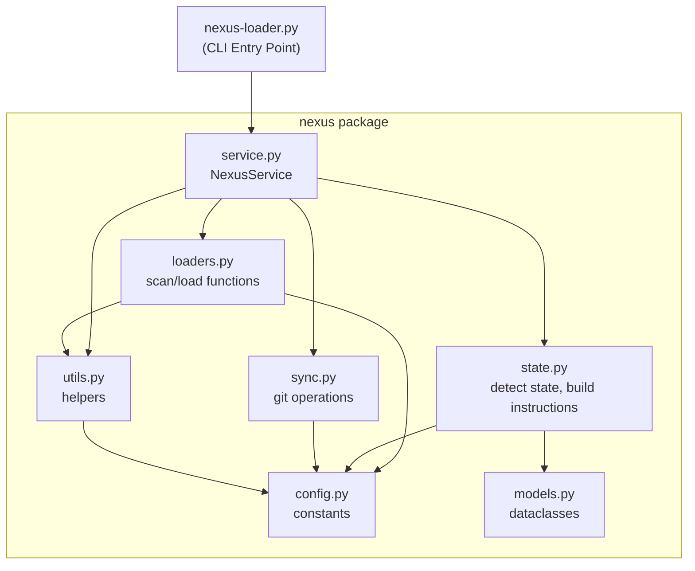
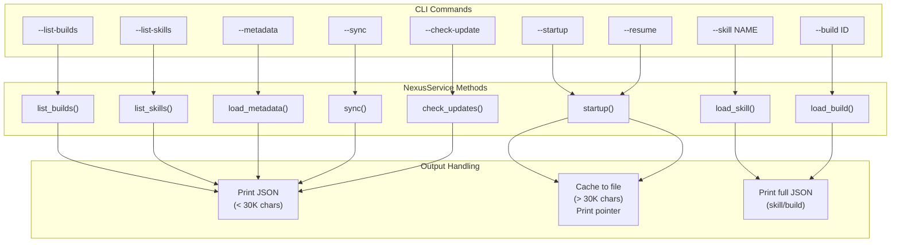
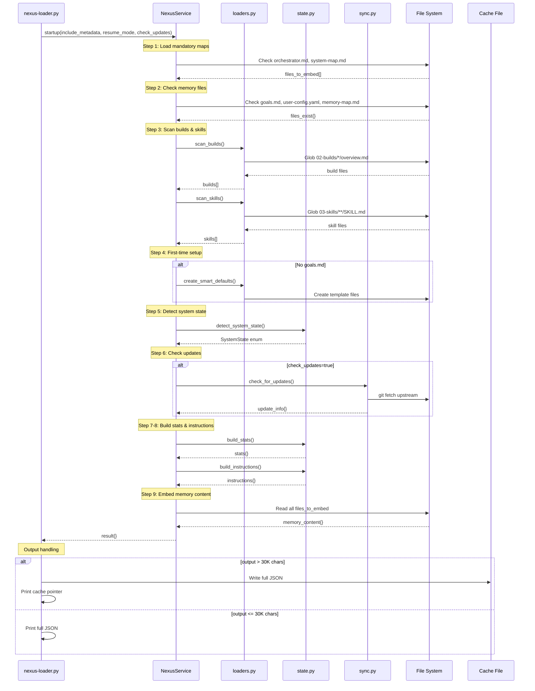
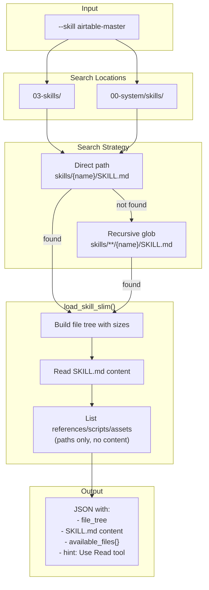
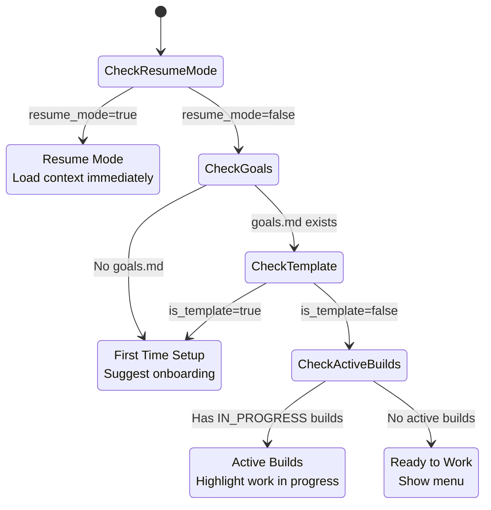
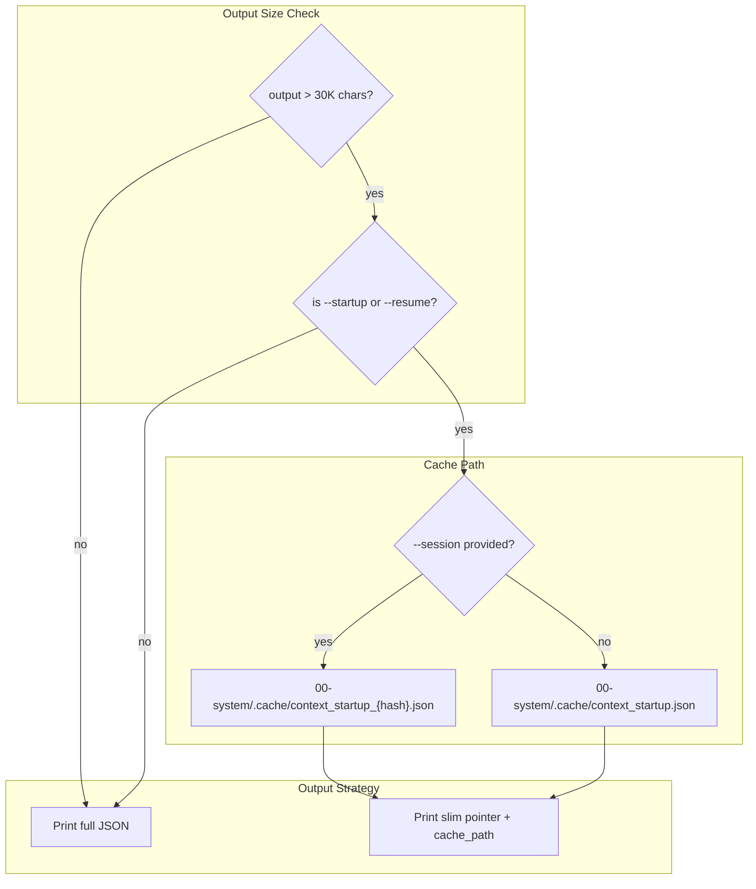
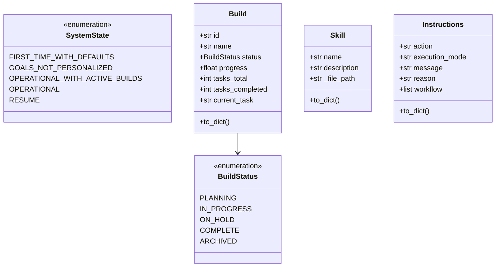

# Nexus Loader Architecture

> Auto-generated documentation for the nexus package.

## Package Structure

```
00-system/core/
├── nexus-loader.py          # CLI wrapper (thin, ~230 lines)
└── nexus/                   # Core package
    ├── __init__.py          # Public API exports, version
    ├── config.py            # Constants, paths, limits
    ├── models.py            # Data classes & enums
    ├── utils.py             # Helper functions
    ├── loaders.py           # Scan/load builds, skills, memory
    ├── state.py             # State detection & instruction building
    ├── service.py           # NexusService (main API)
    ├── sync.py              # Git sync operations
    └── templates/           # Smart default templates
```

---

## Module Dependency Flow



---

## CLI Commands



### Command Reference

| Command | Method | Description |
|---------|--------|-------------|
| `--startup` | `startup()` | Load full context: memory, metadata, instructions |
| `--resume` | `startup(resume_mode=True)` | Resume after context summary |
| `--skill NAME` | `load_skill()` | File tree + SKILL.md (slim mode) |
| `--build ID` | `load_build()` | Build metadata + file paths |
| `--list-builds` | `list_builds()` | Scan all builds |
| `--list-skills` | `list_skills()` | Scan all skills |
| `--metadata` | `load_metadata()` | Builds + skills only |
| `--check-update` | `check_updates()` | Check upstream version |
| `--sync` | `sync()` | Sync from upstream |

---

## Startup Flow

The main entry point for session initialization.



### Startup Result Structure

```json
{
  "loaded_at": "2025-12-31T...",
  "bundle": "startup",
  ">>> EXECUTE_FIRST <<<": { /* instructions */ },
  "system_state": "operational_with_active_builds",
  "memory_content": {
    "orchestrator.md": "...",
    "goals.md": "...",
    "user-config.yaml": "..."
  },
  "metadata": {
    "builds": [...],
    "skills": [...]
  },
  "stats": {
    "total_builds": 14,
    "active_builds": 3,
    "total_skills": 100,
    "goals_personalized": true,
    "display_hints": [...]
  },
  ">>> EXECUTE_AFTER_READING <<<": { /* same instructions (attention sandwich) */ }
}
```

---

## Skill Loading (Slim Mode)

Skills always load in slim mode: file tree + SKILL.md only.



### Skill Output Structure

```json
{
  "loaded_at": "2025-12-31T...",
  "bundle": "skill_slim",
  "skill_name": "airtable-master",
  "skill_path": "C:/.../03-skills/airtable/airtable-master",
  "file_tree": "airtable-master/\n├── references/\n│   ├── api-reference.md (7,755 bytes)\n...",
  "SKILL.md": "---\nname: airtable-master\n...",
  "available_files": {
    "references": ["references/api-reference.md", ...],
    "scripts": ["scripts/query_records.py", ...],
    "assets": []
  },
  "hint": "Use Read tool on any file path to load its content"
}
```

---

## System State Detection



### State → Instructions Mapping

| State | Action | Message |
|-------|--------|---------|
| `FIRST_TIME_WITH_DEFAULTS` | `display_menu` | Welcome! Quick Start Mode active |
| `OPERATIONAL_WITH_ACTIVE_BUILDS` | `display_menu` | Welcome back! N active builds |
| `OPERATIONAL` | `display_menu` | System ready |
| `RESUME` | `EXECUTE_MANDATORY_LOADING_SEQUENCE` | Load build context first |

---

## Cache Strategy

Only startup/resume commands use caching (when output > 30K chars).



### Multi-Session Support

When `--session SESSION_ID` is provided:
1. Hash the session ID: `md5(session_id)[:8]`
2. Cache to: `context_startup_{hash}.json`
3. Prevents collisions between parallel Claude instances

---

## Data Models



---

## Configuration Constants

### Token & Output Limits

| Constant | Value | Purpose |
|----------|-------|---------|
| `CHARS_PER_TOKEN` | 4 | Rough token estimation |
| `CONTEXT_WINDOW` | 200,000 | Claude's context limit |
| `BASH_OUTPUT_LIMIT` | 30,000 | Claude Code bash truncation |
| `METADATA_BUDGET_WARNING` | 7,000 | Warn if metadata tokens exceed |

### Cache Configuration

| Constant | Value |
|----------|-------|
| `CACHE_DIR` | `00-system/.cache` |
| `CACHE_STARTUP_FILE` | `context_startup.json` |

### Mandatory Maps

Always loaded at startup (order matters):
1. `00-system/core/orchestrator.md` - AI behavior rules
2. `00-system/system-map.md` - Navigation structure

### Integration Environment Variables

| Integration | Required Env Var |
|-------------|------------------|
| airtable | `AIRTABLE_API_KEY` |
| notion | `NOTION_API_KEY` |
| beam | `BEAM_API_KEY` |
| hubspot | `HUBSPOT_ACCESS_TOKEN` |

### Sync Configuration

**Sync paths** (updated from upstream):
- `00-system/`
- `CLAUDE.md`
- `README.md`

**Protected paths** (never touched):
- `01-memory/`
- `02-builds/`
- `03-skills/`
- `04-workspace/`
- `.env`
- `.claude/`

---

## Public API

### NexusService

```python
from nexus import NexusService

service = NexusService(base_path=".")

# Session startup
result = service.startup(
    include_metadata=True,
    resume_mode=False,
    check_updates=True
)

# Load specific build
build = service.load_build("14-advanced-hook-system")

# Load skill (slim mode - file tree + SKILL.md only)
skill = service.load_skill("airtable-master")

# List all builds/skills
builds = service.list_builds(full=False)
skills = service.list_skills(full=False)

# Metadata only
metadata = service.load_metadata()

# Git sync
update_info = service.check_updates()
sync_result = service.sync(dry_run=False, force=False)
```

### Backward Compatibility

The CLI wrapper exports these functions for direct import:

```python
from nexus_loader import (
    load_startup,
    load_build,
    load_skill,
    load_metadata,
    scan_builds,
    scan_skills,
    check_for_updates,
    sync_from_upstream,
)
```

---

## Key Design Decisions

### 1. Slim Skill Loading (Default)

Skills always return file tree + SKILL.md only. References/scripts are listed as paths, not loaded.

**Why**: Prevents context bloat. AI uses `Read` tool to load specific files as needed.

### 2. Attention Sandwich

Instructions appear twice in startup result:
- `>>> EXECUTE_FIRST <<<` (at start)
- `>>> EXECUTE_AFTER_READING <<<` (at end)

**Why**: Exploits LLM primacy and recency effects for better instruction following.

### 3. Cache Only for Startup

Only `--startup` and `--resume` use cache redirection. Other commands print full JSON.

**Why**: Startup output (~84KB) exceeds bash limits. Skills/builds need full content.

### 4. Progressive Disclosure

Metadata scanning returns minimal fields by default. Use `--full` for complete data.

**Why**: Reduces token usage for routing decisions.

### 5. Single Source of Truth

Task progress (`tasks_total`, `tasks_completed`, `progress`) is calculated from actual `steps.md` checkboxes, not YAML metadata.

**Why**: Prevents drift between metadata and reality.

---

## Version

Current: `0.15.1` (see `__init__.py`)
