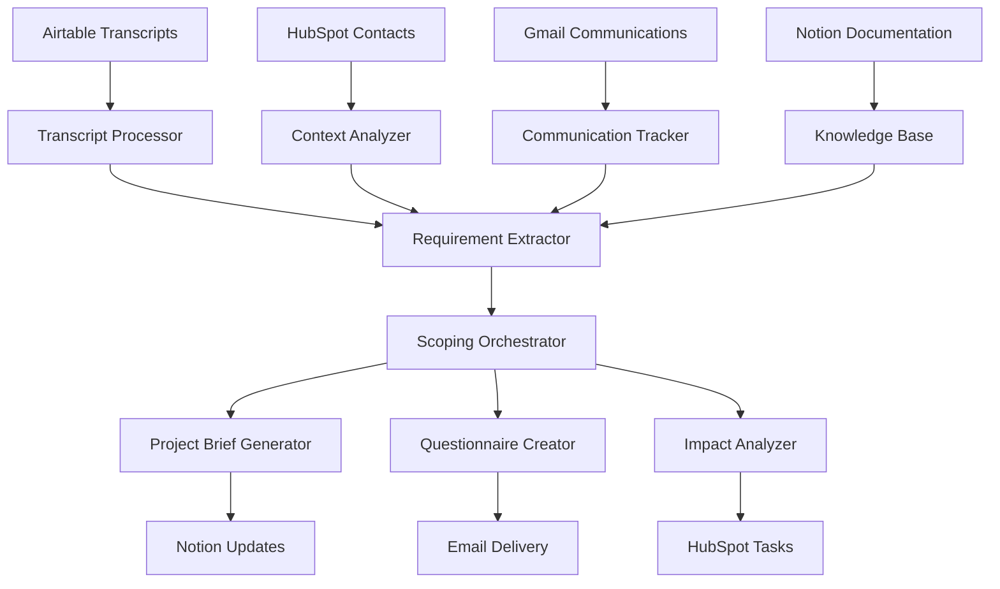

# Beam AI Framework Master Plan
## Comprehensive Lifecycle Management for Agentic Process Automation

### Executive Summary

The Beam AI Framework Master Plan provides a structured approach to planning, scoping, and managing AI agent implementations across the complete lifecycle. This framework integrates with the Beam AI Agentic Process Automation (APA) platform components: Studio V2, Beam API, and Agent OS.

**Key Principles:**
- Interactive scoping and planning (not execution)
- Integration with existing business systems
- Context-driven discovery processes
- Lifecycle-aware project management
- Multi-stakeholder collaboration

---

## Framework Architecture Overview

### System Integration Points
```
External Systems → Scoping Framework → Beam Platform
     ↓                    ↓                ↓
Airtable/HubSpot → Interactive Planning → Studio V2/API/Agent OS
Gmail/Notion     → Transcript Processing → Actual Implementation
Linear/Mintlify  → Questionnaire Gen.   → Live Agent Execution
```

### Core Components
1. **Discovery Engine**: Transcript processing and requirement extraction
2. **Scoping Orchestrator**: Interactive planning and validation
3. **Context Manager**: Multi-project isolation and memory
4. **Integration Hub**: External system connectivity
5. **Planning Interface**: Stakeholder collaboration tools

---

## Lifecycle Stage Framework

### Stage 1: Discovery
**Duration**: 2-4 weeks  
**Primary Goal**: Comprehensive business understanding and requirement gathering

#### Key Activities
- **Business Context Analysis**
  - Current state process mapping
  - Stakeholder identification and role mapping
  - Pain point cataloging and prioritization
  - Success criteria definition

- **Technical Discovery**
  - System integration requirements
  - Data flow analysis
  - Security and compliance needs
  - Performance and scalability requirements

- **Strategic Alignment**
  - Business objective validation
  - ROI expectations setting
  - Timeline constraint identification
  - Resource availability assessment

#### Workflows
```yaml
discovery_workflows:
  initial_assessment:
    trigger: "new_project_request"
    duration: "3-5_days"
    deliverables: ["business_context_brief", "stakeholder_map"]
    
  technical_deep_dive:
    trigger: "initial_assessment_complete"
    duration: "5-7_days"
    deliverables: ["technical_requirements", "integration_map"]
    
  strategic_validation:
    trigger: "technical_deep_dive_complete"
    duration: "2-3_days"
    deliverables: ["aligned_objectives", "success_metrics"]
```

#### Agent Roles
- **Discovery Facilitator**: Leads stakeholder interviews and requirement sessions
- **Technical Analyst**: Evaluates technical feasibility and integration requirements
- **Business Analyst**: Validates business logic and process optimization opportunities
- **Strategic Advisor**: Ensures alignment with organizational goals

### Stage 2: Setup
**Duration**: 1-2 weeks  
**Primary Goal**: Project foundation establishment and planning finalization

#### Key Activities
- **Project Foundation**
  - Scope documentation and approval
  - Resource allocation and team assembly
  - Communication protocols establishment
  - Risk assessment and mitigation planning

- **Technical Preparation**
  - Development environment setup
  - Integration testing framework preparation
  - Security protocol implementation
  - Data pipeline architecture design

- **Governance Framework**
  - Quality gates definition
  - Review and approval processes
  - Change management procedures
  - Success measurement framework

#### Workflows
```yaml
setup_workflows:
  project_initialization:
    trigger: "discovery_approved"
    duration: "2-3_days"
    deliverables: ["project_charter", "resource_plan"]
    
  technical_foundation:
    trigger: "project_initialization_complete"
    duration: "3-5_days"
    deliverables: ["dev_environment", "integration_framework"]
    
  governance_establishment:
    trigger: "technical_foundation_ready"
    duration: "2-3_days"
    deliverables: ["quality_framework", "change_process"]
```

#### Agent Roles
- **Project Manager**: Coordinates all setup activities and resource allocation
- **DevOps Engineer**: Establishes technical infrastructure and deployment pipelines
- **Quality Assurance Lead**: Defines testing frameworks and quality standards
- **Governance Coordinator**: Implements oversight and compliance procedures

### Stage 3: Learning
**Duration**: 4-8 weeks  
**Primary Goal**: Iterative development with continuous stakeholder feedback

#### Key Activities
- **Iterative Development**
  - MVP feature implementation
  - Stakeholder feedback integration
  - Continuous requirement refinement
  - Performance optimization

- **Knowledge Transfer**
  - User training program delivery
  - Documentation creation and maintenance
  - Best practices establishment
  - Support process implementation

- **System Integration**
  - External system connectivity testing
  - Data synchronization validation
  - Security compliance verification
  - Performance benchmarking

#### Workflows
```yaml
learning_workflows:
  iterative_development:
    trigger: "setup_complete"
    duration: "2-4_weeks"
    deliverables: ["mvp_features", "feedback_integration"]
    
  knowledge_transfer:
    trigger: "iterative_development_ongoing"
    duration: "1-2_weeks"
    deliverables: ["training_materials", "user_documentation"]
    
  system_integration:
    trigger: "mvp_validated"
    duration: "1-2_weeks"
    deliverables: ["integration_validation", "performance_baseline"]
```

#### Agent Roles
- **Development Lead**: Oversees feature implementation and technical decisions
- **UX Designer**: Ensures optimal user experience and interface design
- **Integration Specialist**: Manages external system connectivity and data flow
- **Training Coordinator**: Delivers user education and support materials

### Stage 4: Live
**Duration**: Ongoing  
**Primary Goal**: Production deployment with continuous optimization

#### Key Activities
- **Production Deployment**
  - Go-live execution and monitoring
  - User adoption tracking and support
  - Performance monitoring and optimization
  - Issue resolution and maintenance

- **Continuous Improvement**
  - Usage analytics analysis
  - Feature enhancement planning
  - Process optimization identification
  - Scalability planning and implementation

- **Business Value Realization**
  - ROI measurement and reporting
  - Success metrics tracking
  - Stakeholder satisfaction assessment
  - Future roadmap planning

#### Workflows
```yaml
live_workflows:
  production_deployment:
    trigger: "learning_complete"
    duration: "1_week"
    deliverables: ["live_system", "monitoring_dashboard"]
    
  continuous_improvement:
    trigger: "production_stable"
    duration: "ongoing"
    deliverables: ["enhancement_backlog", "optimization_plan"]
    
  value_realization:
    trigger: "production_deployment_complete"
    duration: "ongoing"
    deliverables: ["roi_reports", "success_metrics"]
```

#### Agent Roles
- **Operations Manager**: Oversees production stability and performance
- **Business Intelligence Analyst**: Tracks and reports on business value metrics
- **Customer Success Manager**: Ensures user satisfaction and adoption
- **Product Owner**: Plans future enhancements and roadmap evolution

---

## Agent Framework Architecture

### Core Agent Types

#### 1. Discovery Agents
**Primary Function**: Requirement gathering and analysis

```yaml
discovery_agents:
  transcript_processor:
    capabilities: ["speech_to_text", "requirement_extraction", "sentiment_analysis"]
    integrations: ["airtable", "hubspot", "notion"]
    outputs: ["structured_requirements", "pain_point_analysis", "stakeholder_insights"]
    
  questionnaire_generator:
    capabilities: ["dynamic_form_creation", "adaptive_logic", "response_analysis"]
    integrations: ["email_systems", "web_platforms", "mobile_apps"]
    outputs: ["targeted_questionnaires", "completion_analytics", "insight_reports"]
    
  business_analyst:
    capabilities: ["process_mapping", "gap_analysis", "roi_calculation"]
    integrations: ["crm_systems", "erp_platforms", "analytics_tools"]
    outputs: ["business_case", "process_maps", "value_propositions"]
```

#### 2. Planning Agents
**Primary Function**: Project scoping and resource planning

```yaml
planning_agents:
  scope_architect:
    capabilities: ["requirement_structuring", "dependency_mapping", "risk_assessment"]
    integrations: ["project_management", "documentation", "collaboration"]
    outputs: ["scope_documents", "project_plans", "risk_registers"]
    
  resource_optimizer:
    capabilities: ["capacity_planning", "skill_matching", "timeline_optimization"]
    integrations: ["hr_systems", "project_tools", "calendar_systems"]
    outputs: ["resource_plans", "timeline_estimates", "capacity_reports"]
    
  technical_architect:
    capabilities: ["solution_design", "integration_planning", "technology_selection"]
    integrations: ["development_tools", "infrastructure", "security_systems"]
    outputs: ["technical_specifications", "architecture_diagrams", "integration_plans"]
```

#### 3. Coordination Agents
**Primary Function**: Cross-functional orchestration and communication

```yaml
coordination_agents:
  project_orchestrator:
    capabilities: ["workflow_coordination", "stakeholder_communication", "progress_tracking"]
    integrations: ["project_management", "communication", "reporting"]
    outputs: ["status_reports", "coordination_plans", "stakeholder_updates"]
    
  change_manager:
    capabilities: ["impact_analysis", "communication_planning", "adoption_tracking"]
    integrations: ["hr_systems", "training_platforms", "feedback_tools"]
    outputs: ["change_plans", "communication_strategies", "adoption_metrics"]
    
  quality_coordinator:
    capabilities: ["standards_enforcement", "review_orchestration", "compliance_tracking"]
    integrations: ["quality_tools", "documentation", "audit_systems"]
    outputs: ["quality_reports", "compliance_status", "improvement_recommendations"]
```

---

## Integration Architecture

### External System Connectors

#### CRM Integration (HubSpot)
```yaml
hubspot_integration:
  connection_type: "oauth2_api"
  data_flows:
    inbound:
      - contact_information
      - company_profiles
      - deal_pipeline_data
      - interaction_history
    outbound:
      - discovery_insights
      - project_updates
      - task_assignments
      - timeline_milestones
  
  synchronization:
    frequency: "real_time_webhooks"
    conflict_resolution: "timestamp_based"
    data_validation: "schema_enforcement"
```

#### Documentation Platform (Notion)
```yaml
notion_integration:
  connection_type: "integration_token"
  data_flows:
    inbound:
      - existing_documentation
      - process_descriptions
      - organizational_knowledge
    outbound:
      - project_briefs
      - requirement_documents
      - meeting_summaries
      - progress_reports
  
  synchronization:
    frequency: "batch_processing"
    conflict_resolution: "manual_review"
    data_validation: "content_structure"
```

#### Communication Systems (Gmail)
```yaml
gmail_integration:
  connection_type: "service_account"
  data_flows:
    inbound:
      - email_threads
      - calendar_events
      - attachment_content
    outbound:
      - automated_updates
      - questionnaire_delivery
      - status_notifications
  
  synchronization:
    frequency: "scheduled_polling"
    conflict_resolution: "append_only"
    data_validation: "email_format"
```

#### Call Management (Airtable)
```yaml
airtable_integration:
  connection_type: "api_key"
  data_flows:
    inbound:
      - call_transcripts
      - meeting_metadata
      - participant_information
      - recording_links
    outbound:
      - processed_insights
      - extracted_requirements
      - follow_up_actions
  
  synchronization:
    frequency: "webhook_triggered"
    conflict_resolution: "field_level_merge"
    data_validation: "record_schema"
```

### Data Flow Architecture



---

## Workflow Orchestration

### Primary Workflows

#### 1. Client Discovery Workflow
```yaml
client_discovery:
  name: "Comprehensive Client Discovery Process"
  trigger: "new_project_initiation"
  duration: "2-3_weeks"
  
  steps:
    1_initial_contact:
      duration: "2_days"
      activities:
        - stakeholder_identification
        - initial_questionnaire_delivery
        - calendar_scheduling
      outputs: ["stakeholder_map", "initial_responses"]
    
    2_discovery_sessions:
      duration: "1_week"
      activities:
        - structured_interviews
        - process_observation
        - system_demonstration
      outputs: ["session_transcripts", "observation_notes"]
    
    3_requirement_synthesis:
      duration: "3_days"
      activities:
        - transcript_processing
        - requirement_extraction
        - gap_analysis
      outputs: ["requirement_document", "gap_report"]
    
    4_validation_review:
      duration: "2_days"
      activities:
        - stakeholder_review
        - requirement_confirmation
        - scope_boundary_setting
      outputs: ["validated_requirements", "scope_statement"]
```

#### 2. Scope Impact Analysis Workflow
```yaml
scope_impact_analysis:
  name: "Change Impact Assessment Process"
  trigger: "requirement_change_request"
  duration: "3-5_days"
  
  steps:
    1_change_evaluation:
      duration: "1_day"
      activities:
        - change_request_analysis
        - current_scope_review
        - dependency_mapping
      outputs: ["change_analysis", "dependency_map"]
    
    2_impact_assessment:
      duration: "2_days"
      activities:
        - timeline_impact_calculation
        - resource_requirement_analysis
        - risk_factor_identification
      outputs: ["impact_report", "resource_analysis"]
    
    3_recommendation_development:
      duration: "1_day"
      activities:
        - option_generation
        - cost_benefit_analysis
        - recommendation_synthesis
      outputs: ["options_analysis", "recommendations"]
    
    4_stakeholder_communication:
      duration: "1_day"
      activities:
        - report_preparation
        - stakeholder_notification
        - decision_facilitation
      outputs: ["impact_presentation", "decision_record"]
```

#### 3. Project Brief Update Workflow
```yaml
project_brief_update:
  name: "Dynamic Project Brief Maintenance"
  trigger: "new_information_available"
  duration: "1_day"
  
  steps:
    1_information_processing:
      duration: "4_hours"
      activities:
        - source_data_validation
        - information_categorization
        - relevance_assessment
      outputs: ["processed_information", "relevance_score"]
    
    2_brief_integration:
      duration: "2_hours"
      activities:
        - section_identification
        - content_integration
        - conflict_resolution
      outputs: ["updated_sections", "change_log"]
    
    3_validation_check:
      duration: "1_hour"
      activities:
        - consistency_verification
        - completeness_assessment
        - quality_review
      outputs: ["validation_report", "quality_score"]
    
    4_distribution:
      duration: "1_hour"
      activities:
        - stakeholder_notification
        - version_control_update
        - access_permission_management
      outputs: ["distribution_record", "version_update"]
```

---

## Task Framework

### Discovery Tasks

#### Business Context Tasks
```yaml
business_context_tasks:
  stakeholder_mapping:
    description: "Identify and categorize all project stakeholders"
    estimated_effort: "4_hours"
    deliverables: ["stakeholder_matrix", "influence_map", "communication_plan"]
    dependencies: ["initial_project_briefing"]
    
  current_state_analysis:
    description: "Document existing business processes and systems"
    estimated_effort: "8_hours"
    deliverables: ["process_maps", "system_inventory", "pain_point_catalog"]
    dependencies: ["stakeholder_mapping"]
    
  future_state_visioning:
    description: "Define desired outcomes and success criteria"
    estimated_effort: "6_hours"
    deliverables: ["vision_statement", "success_metrics", "acceptance_criteria"]
    dependencies: ["current_state_analysis"]
```

#### Technical Discovery Tasks
```yaml
technical_discovery_tasks:
  system_integration_assessment:
    description: "Evaluate existing systems and integration requirements"
    estimated_effort: "12_hours"
    deliverables: ["integration_map", "api_inventory", "data_flow_diagrams"]
    dependencies: ["system_inventory"]
    
  security_compliance_review:
    description: "Assess security requirements and compliance needs"
    estimated_effort: "6_hours"
    deliverables: ["security_requirements", "compliance_checklist", "risk_assessment"]
    dependencies: ["system_integration_assessment"]
    
  performance_requirement_definition:
    description: "Establish performance and scalability requirements"
    estimated_effort: "4_hours"
    deliverables: ["performance_specifications", "scalability_targets", "monitoring_requirements"]
    dependencies: ["future_state_visioning"]
```

### Planning Tasks

#### Scope Management Tasks
```yaml
scope_management_tasks:
  requirement_prioritization:
    description: "Rank requirements by business value and complexity"
    estimated_effort: "4_hours"
    deliverables: ["prioritized_backlog", "value_matrix", "complexity_assessment"]
    dependencies: ["requirement_validation"]
    
  scope_boundary_definition:
    description: "Clearly define project boundaries and exclusions"
    estimated_effort: "3_hours"
    deliverables: ["scope_statement", "exclusion_list", "assumption_register"]
    dependencies: ["requirement_prioritization"]
    
  dependency_mapping:
    description: "Identify and document project dependencies"
    estimated_effort: "5_hours"
    deliverables: ["dependency_matrix", "critical_path_analysis", "risk_register"]
    dependencies: ["scope_boundary_definition"]
```

#### Resource Planning Tasks
```yaml
resource_planning_tasks:
  skill_requirement_analysis:
    description: "Identify required skills and expertise for project execution"
    estimated_effort: "3_hours"
    deliverables: ["skill_matrix", "expertise_requirements", "training_needs"]
    dependencies: ["technical_specifications"]
    
  capacity_planning:
    description: "Assess resource availability and capacity constraints"
    estimated_effort: "4_hours"
    deliverables: ["capacity_model", "resource_allocation_plan", "constraint_analysis"]
    dependencies: ["skill_requirement_analysis"]
    
  timeline_estimation:
    description: "Develop realistic project timeline and milestones"
    estimated_effort: "6_hours"
    deliverables: ["project_timeline", "milestone_schedule", "critical_path"]
    dependencies: ["capacity_planning", "dependency_mapping"]
```

---

## Integration Specifications

### Data Integration Framework

#### Input Data Sources
```yaml
input_sources:
  airtable_transcripts:
    table_structure:
      - call_id: "unique_identifier"
      - transcript_text: "full_conversation_text"
      - participants: "array_of_attendees"
      - call_date: "iso_datetime"
      - call_duration: "minutes"
      - call_type: "discovery|validation|follow_up"
    
    processing_requirements:
      - speaker_identification: "automatic_with_manual_override"
      - quality_assessment: "audio_clarity_scoring"
      - content_categorization: "topic_and_intent_classification"
  
  hubspot_contacts:
    object_structure:
      - contact_id: "hubspot_contact_id"
      - company_info: "associated_company_data"
      - interaction_history: "emails_calls_meetings"
      - deal_information: "associated_opportunities"
      - custom_properties: "client_specific_fields"
    
    processing_requirements:
      - relationship_mapping: "contact_to_project_association"
      - context_enrichment: "additional_data_gathering"
      - preference_tracking: "communication_and_engagement"
  
  notion_documentation:
    page_structure:
      - page_id: "unique_notion_identifier"
      - content_blocks: "structured_content_elements"
      - metadata: "creation_and_modification_info"
      - relationships: "linked_pages_and_databases"
    
    processing_requirements:
      - content_extraction: "text_and_structured_data"
      - knowledge_mapping: "topic_and_concept_identification"
      - version_tracking: "change_history_maintenance"
```

#### Output Data Destinations
```yaml
output_destinations:
  project_briefs:
    storage_location: "notion_database"
    structure:
      - executive_summary: "high_level_project_overview"
      - business_objectives: "goals_and_success_criteria"
      - technical_requirements: "system_and_integration_specs"
      - scope_definition: "inclusions_exclusions_assumptions"
      - timeline_milestones: "key_dates_and_deliverables"
    
    update_triggers:
      - new_transcript_processed
      - requirement_change_identified
      - stakeholder_feedback_received
  
  questionnaires:
    delivery_channels: ["email", "web_portal", "embedded_forms"]
    formats: ["interactive_html", "pdf_printable", "mobile_optimized"]
    response_collection: ["database_storage", "real_time_analytics", "automated_follow_up"]
  
  insights_reports:
    distribution: ["stakeholder_email", "dashboard_updates", "api_endpoints"]
    formats: ["executive_summary", "detailed_analysis", "data_visualizations"]
    frequency: ["real_time", "daily_digest", "weekly_summary", "milestone_based"]
```

### API Integration Specifications

#### Authentication Framework
```yaml
authentication:
  hubspot:
    method: "oauth2_private_app"
    scopes: ["contacts.read", "companies.read", "deals.read", "timeline.write"]
    token_refresh: "automatic_with_fallback"
    rate_limits: "100_requests_per_10_seconds"
  
  airtable:
    method: "api_key_bearer_token"
    permissions: ["records.read", "records.write", "schema.read"]
    rate_limits: "5_requests_per_second_per_base"
    webhook_support: "real_time_notifications"
  
  notion:
    method: "integration_token"
    capabilities: ["pages.read", "pages.write", "databases.query", "databases.update"]
    rate_limits: "3_requests_per_second"
    content_limits: "2000_blocks_per_page"
  
  gmail:
    method: "service_account_oauth2"
    scopes: ["gmail.readonly", "gmail.send", "calendar.readonly"]
    delegation: "domain_wide_if_required"
    rate_limits: "1_billion_quota_units_per_day"
```

#### Error Handling and Resilience
```yaml
error_handling:
  retry_policies:
    transient_errors:
      max_retries: 3
      backoff_strategy: "exponential_with_jitter"
      timeout_escalation: "15s_30s_60s"
    
    rate_limit_exceeded:
      behavior: "queue_and_wait"
      max_queue_size: 1000
      priority_handling: "business_critical_first"
  
  fallback_mechanisms:
    service_unavailable:
      primary_action: "queue_for_later_processing"
      notification: "stakeholder_alert_after_30_minutes"
      manual_override: "admin_force_processing_option"
    
    authentication_failure:
      primary_action: "attempt_token_refresh"
      fallback: "admin_notification_for_reauth"
      grace_period: "24_hours_before_service_degradation"
  
  monitoring_and_alerting:
    health_checks:
      frequency: "every_5_minutes"
      endpoints: ["api_connectivity", "database_health", "processing_queue_status"]
    
    alert_conditions:
      - error_rate_above_5_percent
      - response_time_above_30_seconds
      - queue_depth_above_100_items
      - authentication_failures_above_3_per_hour
```

---

## Success Metrics and KPIs

### Discovery Effectiveness Metrics
```yaml
discovery_metrics:
  requirement_quality:
    - requirement_completeness_score: "percentage_of_complete_requirements"
    - requirement_clarity_rating: "average_stakeholder_understanding_score"
    - requirement_stability: "change_frequency_over_time"
  
  stakeholder_engagement:
    - participation_rate: "percentage_of_invited_participants_engaged"
    - response_quality: "depth_and_detail_of_questionnaire_responses"
    - satisfaction_score: "post_discovery_stakeholder_satisfaction"
  
  process_efficiency:
    - time_to_complete_discovery: "days_from_start_to_validated_requirements"
    - questions_to_requirements_ratio: "efficiency_of_information_gathering"
    - rework_frequency: "number_of_requirement_revisions_needed"
```

### Planning Accuracy Metrics
```yaml
planning_metrics:
  scope_accuracy:
    - scope_creep_percentage: "unplanned_additions_as_percentage_of_original"
    - requirement_change_frequency: "changes_per_week_during_execution"
    - scope_boundary_clarity: "percentage_of_clear_in_vs_out_decisions"
  
  estimation_accuracy:
    - timeline_variance: "actual_vs_estimated_completion_time"
    - resource_utilization_accuracy: "actual_vs_planned_resource_usage"
    - complexity_assessment_accuracy: "estimated_vs_actual_implementation_complexity"
  
  stakeholder_alignment:
    - consensus_score: "percentage_of_stakeholders_aligned_on_scope"
    - priority_agreement: "stakeholder_agreement_on_requirement_priorities"
    - expectation_clarity: "percentage_of_clear_success_criteria"
```

### Business Value Metrics
```yaml
business_value_metrics:
  project_success:
    - on_time_delivery_rate: "percentage_of_projects_delivered_on_schedule"
    - budget_adherence: "percentage_variance_from_approved_budget"
    - stakeholder_satisfaction: "post_project_satisfaction_scores"
  
  business_impact:
    - roi_achievement: "actual_vs_projected_return_on_investment"
    - process_improvement: "quantified_efficiency_gains_achieved"
    - user_adoption: "percentage_of_intended_users_actively_engaged"
  
  framework_effectiveness:
    - discovery_to_delivery_cycle_time: "total_time_from_initial_contact_to_go_live"
    - requirement_accuracy_rate: "percentage_of_requirements_delivered_as_specified"
    - client_retention: "percentage_of_clients_engaging_for_additional_projects"
```

---

## Risk Management Framework

### Risk Categories and Mitigation Strategies

#### Discovery Risks
```yaml
discovery_risks:
  incomplete_stakeholder_engagement:
    probability: "medium"
    impact: "high"
    mitigation:
      - multiple_engagement_channels
      - executive_sponsor_involvement
      - flexible_scheduling_options
    contingency:
      - targeted_follow_up_sessions
      - assumption_documentation_with_validation_checkpoints
  
  requirement_ambiguity:
    probability: "high"
    impact: "medium"
    mitigation:
      - structured_validation_sessions
      - prototype_based_requirement_clarification
      - multiple_stakeholder_perspective_gathering
    contingency:
      - iterative_requirement_refinement_process
      - assumption_tracking_with_regular_validation
  
  changing_business_priorities:
    probability: "medium"
    impact: "high"
    mitigation:
      - regular_business_context_reviews
      - flexible_scope_management_approach
      - strong_executive_sponsorship
    contingency:
      - rapid_scope_adjustment_process
      - priority_re_alignment_workshops
```

#### Integration Risks
```yaml
integration_risks:
  external_system_dependencies:
    probability: "medium"
    impact: "medium"
    mitigation:
      - early_integration_testing
      - fallback_option_identification
      - vendor_relationship_management
    contingency:
      - manual_process_alternatives
      - phased_integration_approach
  
  data_quality_issues:
    probability: "high"
    impact: "medium"
    mitigation:
      - comprehensive_data_validation
      - data_cleansing_processes
      - source_system_quality_improvements
    contingency:
      - data_quality_monitoring_and_alerting
      - manual_data_correction_processes
  
  api_rate_limiting:
    probability: "medium"
    impact: "low"
    mitigation:
      - efficient_api_usage_patterns
      - caching_strategies
      - batch_processing_optimization
    contingency:
      - queue_based_processing
      - alternative_data_source_utilization
```

#### Project Delivery Risks
```yaml
delivery_risks:
  scope_creep:
    probability: "high"
    impact: "medium"
    mitigation:
      - clear_scope_boundary_definition
      - change_control_process
      - regular_stakeholder_communication
    contingency:
      - scope_adjustment_with_timeline_impact_analysis
      - priority_based_feature_deferral
  
  resource_availability:
    probability: "medium"
    impact: "high"
    mitigation:
      - early_resource_planning
      - cross_training_programs
      - vendor_partnership_development
    contingency:
      - timeline_adjustment_based_on_available_resources
      - scope_prioritization_for_critical_path_optimization
  
  technology_constraints:
    probability: "low"
    impact: "high"
    mitigation:
      - thorough_technical_feasibility_assessment
      - proof_of_concept_development
      - alternative_technology_evaluation
    contingency:
      - architecture_redesign_with_alternative_approaches
      - phased_implementation_with_technology_evolution
```

---

## Implementation Guidelines

### Phase 1: Framework Foundation (Weeks 1-2)
```yaml
foundation_phase:
  activities:
    - core_component_setup
    - integration_framework_establishment
    - initial_workflow_configuration
    - basic_monitoring_implementation
  
  deliverables:
    - functional_transcript_processor
    - basic_questionnaire_generator
    - initial_integration_connections
    - monitoring_dashboard
  
  success_criteria:
    - all_integrations_authenticated_and_tested
    - sample_transcript_successfully_processed
    - basic_questionnaire_generated_and_delivered
    - monitoring_alerts_configured_and_functional
```

### Phase 2: Discovery Process Implementation (Weeks 3-4)
```yaml
discovery_phase:
  activities:
    - comprehensive_discovery_workflow_deployment
    - stakeholder_engagement_process_refinement
    - requirement_extraction_optimization
    - validation_process_implementation
  
  deliverables:
    - complete_discovery_workflow
    - stakeholder_engagement_templates
    - requirement_validation_framework
    - discovery_quality_metrics
  
  success_criteria:
    - end_to_end_discovery_process_validated
    - stakeholder_satisfaction_above_80_percent
    - requirement_extraction_accuracy_above_85_percent
    - discovery_timeline_within_planned_parameters
```

### Phase 3: Planning and Scoping Enhancement (Weeks 5-6)
```yaml
planning_phase:
  activities:
    - scope_impact_analysis_implementation
    - resource_planning_optimization
    - timeline_estimation_refinement
    - risk_assessment_automation
  
  deliverables:
    - scope_impact_analyzer
    - resource_planning_tools
    - automated_timeline_estimation
    - risk_assessment_framework
  
  success_criteria:
    - scope_change_impact_analysis_accuracy_above_90_percent
    - resource_planning_efficiency_improved_by_40_percent
    - timeline_estimation_variance_below_15_percent
    - risk_identification_completeness_above_85_percent
```

### Phase 4: Integration and Optimization (Weeks 7-8)
```yaml
optimization_phase:
  activities:
    - full_system_integration_testing
    - performance_optimization
    - user_experience_enhancement
    - comprehensive_documentation_completion
  
  deliverables:
    - fully_integrated_system
    - performance_optimization_report
    - user_training_materials
    - complete_system_documentation
  
  success_criteria:
    - system_performance_within_specified_parameters
    - user_satisfaction_above_90_percent
    - integration_stability_above_99_percent
    - documentation_completeness_100_percent
```

---

## Conclusion

The Beam AI Framework Master Plan provides a comprehensive, structured approach to planning and scoping AI agent implementations. By focusing on interactive discovery, systematic planning, and integration with existing business systems, this framework enables organizations to maximize the value of their Agentic Process Automation initiatives.

The framework's emphasis on lifecycle-aware management, stakeholder collaboration, and continuous optimization ensures that AI agent implementations are not only technically successful but also deliver measurable business value and maintain long-term sustainability.

**Next Steps:**
1. Review and customize framework components for organizational context
2. Establish integration connections with existing systems
3. Train stakeholders on discovery and planning processes
4. Implement monitoring and continuous improvement mechanisms
5. Begin pilot project implementation using framework guidelines

---

*Framework Version: 1.0*  
*Last Updated: Current Session*  
*Document Classification: Master Planning Framework