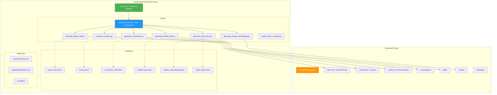
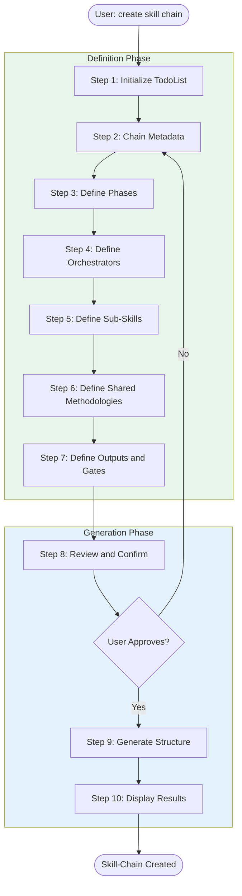
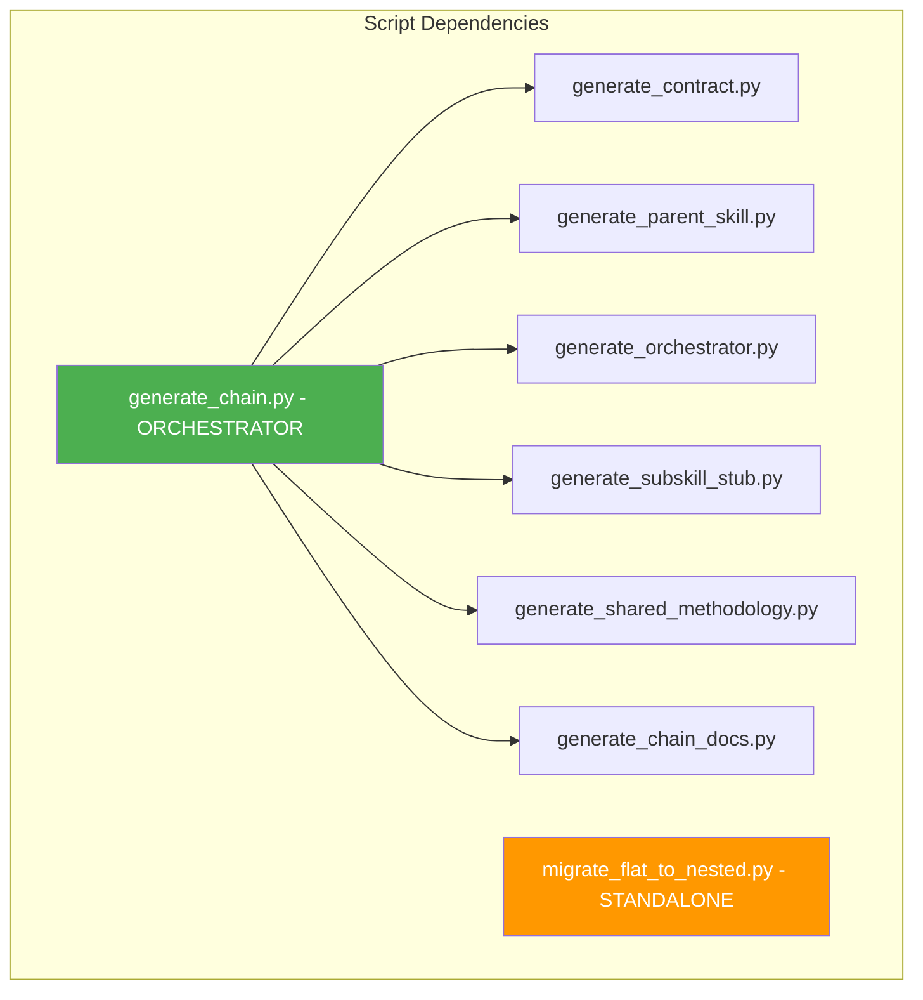
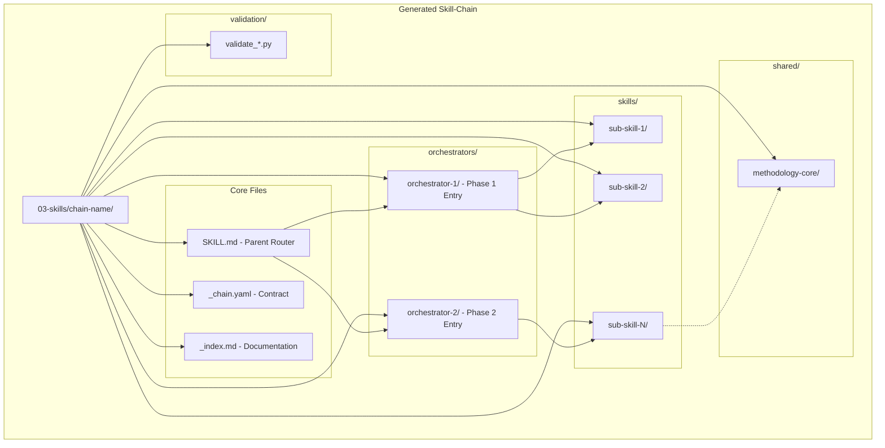
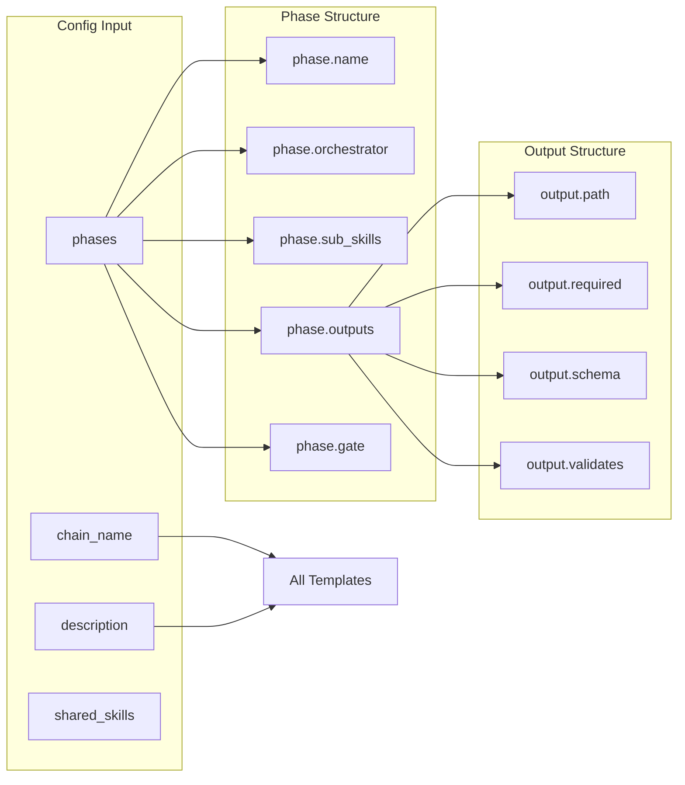
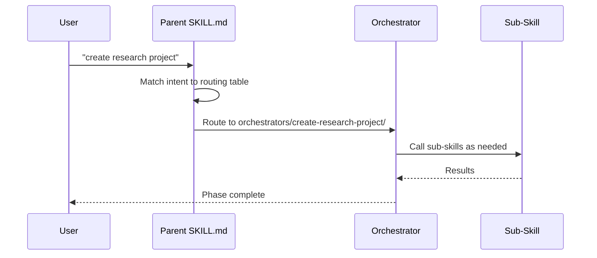
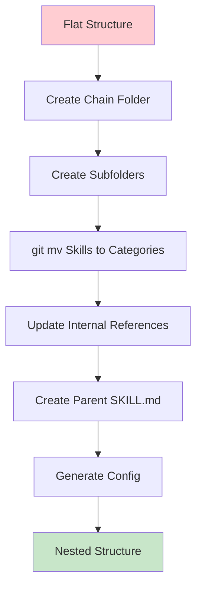

# Create Skill-Chain Algorithm Documentation

> Comprehensive documentation of the Nexus Create Skill-Chain system for generating nested skill-chain architectures.

---

## Overview

The **Create Skill-Chain** is a META-SKILL that automates the creation of nested skill-chain infrastructure. It guides users through an interactive 10-step workflow to define chain structure, generates complete folder hierarchies, and produces all necessary files including parent routers, contracts, orchestrators, sub-skills, and documentation with Mermaid diagrams.

**Key Capabilities:**
- **8 Generation Scripts** - Python modules for file generation
- **6 Jinja2 Templates** - Standardized output formats
- **Migration Tool** - Convert flat skills to nested structure
- **Validation Contracts** - YAML schemas for chain verification

---

## System Architecture



---

## Interactive Workflow (10 Steps)



---

## Workflow Step Details

### Step 1: Initialize TodoList
**Action:** Automated creation of TodoWrite tracking

- [ ] Gather chain metadata
- [ ] Define phases
- [ ] Define orchestrators
- [ ] Define sub-skills
- [ ] Define shared methodologies
- [ ] Define outputs and gates
- [ ] Review and confirm
- [ ] Generate structure


### Step 2: Chain Metadata
**Prompts:**
```
What's the name of this skill-chain?
(Use kebab-case, e.g., "interview-analysis", "content-pipeline")

Brief description of what this skill-chain does:
```

**Captures:**
- `chain_name` (kebab-case)
- `chain_description` (one line)

### Step 3: Define Phases
**Prompts:**
```
Skill-chains are organized into PHASES.

Each phase has:
- One ORCHESTRATOR (user-facing entry point)
- Multiple SUB-SKILLS (called by the orchestrator)

How many phases does {chain_name} have? (1-5)

Phase {N} name? (e.g., "planning", "execution", "review")
```

**Captures:**
- `phases` array with names

### Step 4: Define Orchestrators
**Prompts:**
```
Phase {N}: {phase_name}

What's the orchestrator skill name?
(This is the user-facing entry point for this phase)

Example: "create-research-project", "execute-interview-project"
```

**Captures:**
- `phases[N].orchestrator` name

### Step 5: Define Sub-Skills
**Prompts:**
```
Orchestrator: {orchestrator_name}

What sub-skills does this orchestrator use?
(Comma-separated list)

Example: "paper-search, pdf-preprocess, paper-analyze"
```

**Captures:**
- `phases[N].sub_skills` array

### Step 6: Define Shared Methodologies
**Prompts:**
```
SHARED METHODOLOGIES are skills loaded by subagents, never directly.

Does {chain_name} have any shared methodologies? (y/n)

List shared methodology names (comma-separated):
```

**Captures:**
- `shared_skills` array (optional)

### Step 7: Define Outputs and Gates
**Prompts:**
```
Orchestrator: {orchestrator_name}

What files does this orchestrator produce?
(One per line, prefix with * for required)

Example:
*_briefing.md
*_analysis_kit.md
papers/*/_metadata.json

What conditions must pass before the NEXT phase can start?
(Gate conditions, one per line)

Example:
papers_with_chunks > 0
_briefing.md exists
```

**Captures:**
- `phases[N].outputs` array
- `phases[N].gate` conditions

### Step 8: Review and Confirm
**Displays:**
```
━━━━━━━━━━━━━━━━━━━━━━━━━━━━━━━━━━━━━━━━━━━━━━━━━━━
SKILL-CHAIN SUMMARY: {chain_name}
━━━━━━━━━━━━━━━━━━━━━━━━━━━━━━━━━━━━━━━━━━━━━━━━━━━

Description: {chain_description}

PHASES:
  Phase {N}: {phase_name}
    Orchestrator: {orchestrator}
    Sub-skills: {sub_skills}
    Outputs: {outputs}
    Gate: {gate_name}

SHARED METHODOLOGIES:
  {shared_skills or "None"}

STRUCTURE TO GENERATE:
03-skills/{chain_name}/
├── SKILL.md                 (parent router)
├── _chain.yaml              (contract)
├── _index.md                (documentation)
├── orchestrators/
├── skills/
├── shared/
└── validation/

Generate this structure? (y/n)
```

### Step 9: Generate Structure
**Executes:**
```bash
python 03-skills/create-skill-chain/scripts/generate_chain.py \
  --name "{chain_name}" \
  --config "{json_config}"
```

**Creates:**
1. Parent `SKILL.md` (router)
2. `_chain.yaml` (contract)
3. `_index.md` (documentation with Mermaid)
4. Orchestrator SKILL.md files
5. Sub-skill SKILL.md stubs
6. Shared methodology SKILL.md files
7. Complete folder structure

### Step 10: Display Results
**Shows:**
```
Skill-chain generated!
━━━━━━━━━━━━━━━━━━━━━━━━━━━━━━━━━━━━━━━━━━━━━━━━━━━

Created: 03-skills/{chain_name}/
├── SKILL.md                 ✓
├── _chain.yaml              ✓
├── _index.md                ✓
├── orchestrators/
│   └── {N} orchestrator(s)  ✓
├── skills/
│   └── {N} sub-skill(s)     ✓
├── shared/
│   └── {N} shared skill(s)  ✓
└── validation/              ✓

NEXT STEPS:
1. Review generated SKILL.md files
2. Implement sub-skill logic (scripts/, references/)
3. Test the chain: "run {orchestrator_name}"
4. Validate with: validate-skill-chain {chain_name}
```

---

## Script Architecture



### Script Reference

| Script | Purpose | Input | Output |
|--------|---------|-------|--------|
| `generate_chain.py` | Main orchestrator | JSON config | All files |
| `generate_contract.py` | Create contract | Config dict | `_chain.yaml` |
| `generate_parent_skill.py` | Create router | Config dict | `SKILL.md` |
| `generate_orchestrator.py` | Create phase skills | Config + phase | `orchestrators/*/SKILL.md` |
| `generate_subskill_stub.py` | Create sub-skills | Config + skill | `skills/*/SKILL.md` |
| `generate_shared_methodology.py` | Create shared | Config + shared | `shared/*/SKILL.md` |
| `generate_chain_docs.py` | Create docs | Config dict | `_index.md` |
| `migrate_flat_to_nested.py` | Migration helper | CLI args | Nested structure |

---

## Contract Schema

### Full YAML Schema

```yaml
# Required: Chain identification
name: string                    # kebab-case chain name
version: string                 # Semantic version (e.g., "1.0")
description: string             # Human-readable description
generated: ISO8601              # Generation date (auto)

# Required: Structure definition
structure:
  type: nested                  # Always "nested"
  parent_skill: SKILL.md        # Path to parent router
  subfolders:                   # Standard folders
    - orchestrators
    - skills
    - shared
    - validation

# Required: Skill definitions
skills:
  - id: string                  # Skill name (kebab-case)
    phase: int                  # Phase number (1, 2, 3...)
    type: orchestrator|sub-skill|shared-methodology
    path: string                # Relative path from chain root
    description: string         # What this skill does

    # For orchestrators:
    uses: [string]              # Sub-skills used
    produces:                   # Output files
      - path: string            # Glob patterns allowed
        required: bool
        schema: string          # Schema reference
        min_count: int          # For glob patterns
        validates:              # Field validation
          - field: string
            equals|in|exists: value
    gate: string                # Gate reference

    # For sub-skills:
    called_by: string           # Parent orchestrator

    # For shared:
    note: string                # "DO NOT LOAD DIRECTLY"

# Optional: Schemas for validation
schemas:
  schema_name:
    required_fields: [string]
    optional_fields: [string]

# Optional: Gates for phase transitions
gates:
  gate_name:
    after_phase: int
    checks: [string]            # Boolean expressions
```

### Gate Expression Syntax

| Expression | Meaning |
|------------|---------|
| `file.md exists` | File exists in project |
| `count > N` | Count exceeds N |
| `field == value` | Field equals value |
| `field != value` | Field not equals value |

---

## Generated Structure



### Folder Purposes

| Folder | Purpose | User-Facing |
|--------|---------|-------------|
| `orchestrators/` | Phase entry points | Yes |
| `skills/` | Sub-skills called by orchestrators | Via parent |
| `shared/` | Methodologies for subagents | Never |
| `validation/` | Validation scripts | External |

---

## Template System

### Template Variables



### Template Reference

| Template | Output | Key Variables |
|----------|--------|---------------|
| `parent_skill.md.j2` | `SKILL.md` | chain_name, phases, shared_skills |
| `chain.yaml.j2` | `_chain.yaml` | phases, schemas, gates |
| `orchestrator_skill.md.j2` | `orchestrators/*/SKILL.md` | orchestrator_name, phase_num, sub_skills |
| `subskill_stub.md.j2` | `skills/*/SKILL.md` | skill_name, orchestrator_name, phase_name |
| `shared_methodology.md.j2` | `shared/*/SKILL.md` | shared_name, chain_name |
| `chain_index.md.j2` | `_index.md` | phases, shared_skills (Mermaid diagrams) |

---

## Pattern: CONNECT/ROUTER

The parent SKILL.md follows the **CONNECT/ROUTER** pattern:



### Key Principles

1. **Single Entry Point**: Parent SKILL.md is the ONLY discoverable skill
2. **Intent-Based Routing**: User intent maps to child skills
3. **Hidden Structure**: Users never need to know internal organization
4. **Relative Paths**: All internal references use relative paths

---

## Migration Tool

### Usage

```bash
python migrate_flat_to_nested.py \
  --chain-name "research-pipeline" \
  --skills "paper-search,pdf-preprocess,paper-analyze,paper-synthesize" \
  --orchestrators "create-research-project,execute-research-project" \
  --shared "paper-analyze-core" \
  --dry-run
```

### Migration Process



---

## Reference Implementation: Research Pipeline

The research-pipeline is the reference implementation showing:

```
03-skills/research-pipeline/
├── SKILL.md                          # Parent router
├── _chain.yaml                       # Contract (9 skills, 2 phases)
├── _index.md                         # Mermaid architecture + flow
├── orchestrators/
│   ├── create-research-project/      # Phase 1: 10 steps
│   └── execute-research-project/     # Phase 2: 5 steps
├── skills/
│   ├── paper-search/                 # Search 9 APIs
│   ├── pdf-preprocess/               # Convert PDF → chunks
│   ├── paper-analyze/                # Spawn subagents
│   ├── paper-synthesize/             # Cross-paper synthesis
│   ├── paper-query/                  # Query analyzed papers
│   └── paper-manage/                 # Collection management
├── shared/
│   └── paper-analyze-core/           # 7-step methodology
└── validation/
    ├── validate_analysis.py          # Schema v2.2 validation
    └── validate_synthesis.py         # Synthesis validation
```

### Key Patterns Demonstrated

| Pattern | Example |
|---------|---------|
| Two-Phase Handoff | Phase 1 → Readiness Gate → Phase 2 |
| Subagent Orchestration | paper-analyze spawns analysis subagents |
| Anti-Hallucination | 3-point evidence (start/mid/end + hash) |
| Progressive Disclosure | _analysis_log.md → index.md → synthesis |
| Schema Versioning | Schema v2.0 → v2.1 → v2.2 |

---

## Example: Interview Analysis Chain

### Configuration

```json
{
  "name": "interview-analysis",
  "description": "Analyze interview transcripts for themes",
  "version": "1.0",
  "phases": [
    {
      "name": "preparation",
      "orchestrator": "prepare-interview-project",
      "sub_skills": ["transcript-import", "transcript-preprocess"],
      "outputs": [
        {"path": "02-resources/_briefing.md", "required": true},
        {"path": "02-resources/transcripts/*/_metadata.json", "required": true, "min_count": 1}
      ],
      "gate": {
        "name": "readiness-gate",
        "conditions": ["transcripts_preprocessed > 0", "_briefing.md exists"]
      }
    },
    {
      "name": "analysis",
      "orchestrator": "execute-interview-analysis",
      "sub_skills": ["transcript-analyze", "theme-synthesize"],
      "outputs": [
        {"path": "02-resources/transcripts/*/index.md", "required": true},
        {"path": "04-outputs/_synthesis.md", "required": true}
      ]
    }
  ],
  "shared_skills": ["transcript-analyze-core"]
}
```

### Generated Structure

```
03-skills/interview-analysis/
├── SKILL.md
├── _chain.yaml
├── _index.md
├── orchestrators/
│   ├── prepare-interview-project/
│   │   └── SKILL.md
│   └── execute-interview-analysis/
│       └── SKILL.md
├── skills/
│   ├── transcript-import/
│   │   └── SKILL.md
│   ├── transcript-preprocess/
│   │   └── SKILL.md
│   ├── transcript-analyze/
│   │   └── SKILL.md
│   └── theme-synthesize/
│       └── SKILL.md
├── shared/
│   └── transcript-analyze-core/
│       └── SKILL.md
└── validation/
```

---

## Quality Checklist

### Structure Validation
- [ ] Parent SKILL.md exists with routing table
- [ ] `_chain.yaml` contract exists with all skills
- [ ] `_index.md` has Mermaid diagrams
- [ ] All orchestrators in `orchestrators/`
- [ ] All sub-skills in `skills/`
- [ ] Shared methodologies in `shared/`

### Parent SKILL.md
- [ ] Has `type: skill-chain` in frontmatter
- [ ] Has comprehensive trigger phrases
- [ ] Has routing table for all child skills
- [ ] Notes "DO NOT LOAD DIRECTLY" for shared

### Contract
- [ ] All skills listed with correct paths
- [ ] Outputs defined for orchestrators
- [ ] Gates defined between phases
- [ ] Schemas defined if needed

### Child Skills
- [ ] Reference parent with relative path
- [ ] Orchestrators list their sub-skills
- [ ] Sub-skills note their calling orchestrator
- [ ] Shared skills have "DO NOT LOAD" warning

---

## CLI Reference

### Generate Chain
```bash
python scripts/generate_chain.py \
  --name "{chain-name}" \
  --config '{"json": "config"}' \
  [--config-file config.json] \
  [--output-dir path/to/output] \
  [--dry-run]
```

### Migrate Flat to Nested
```bash
python scripts/migrate_flat_to_nested.py \
  --chain-name "{chain-name}" \
  --skills "skill1,skill2,skill3" \
  --orchestrators "orch1,orch2" \
  [--shared "shared1,shared2"] \
  [--skills-dir "03-skills"] \
  [--dry-run]
```

---

## Version History

| Version | Date | Changes |
|---------|------|---------|
| 1.0 | 2025-12-27 | Initial release with 8 scripts, 6 templates |

---

**Last Updated**: 2025-12-27
