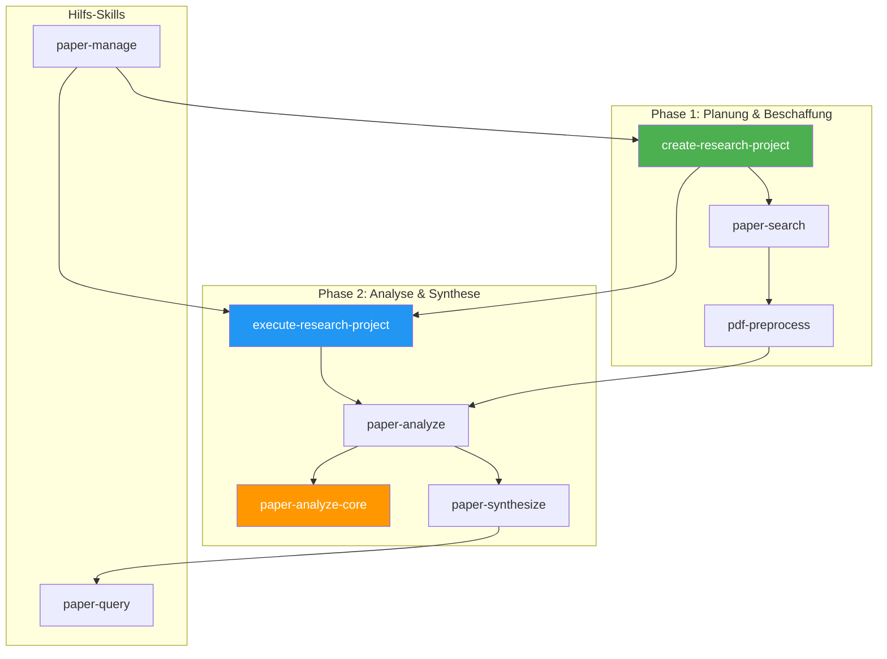
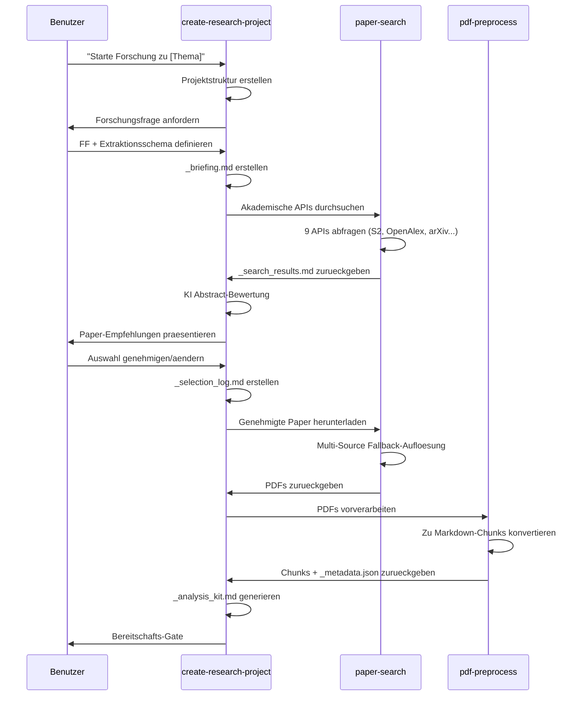
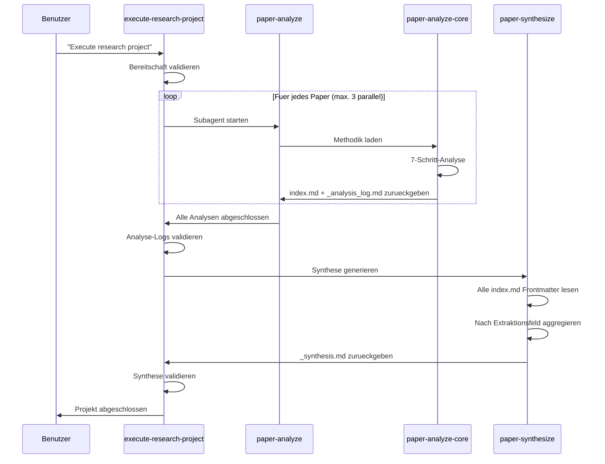
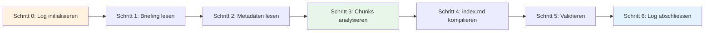
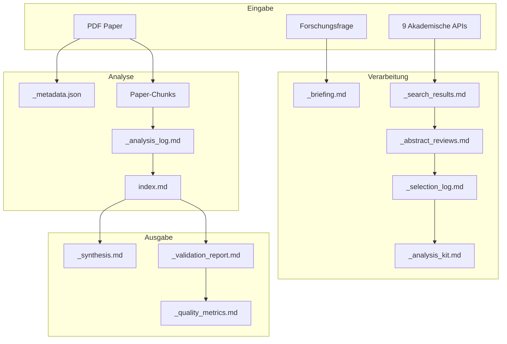
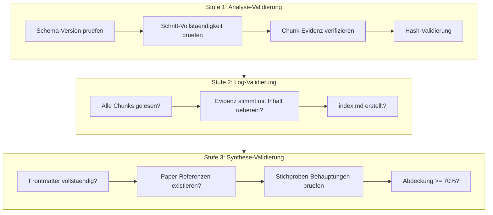
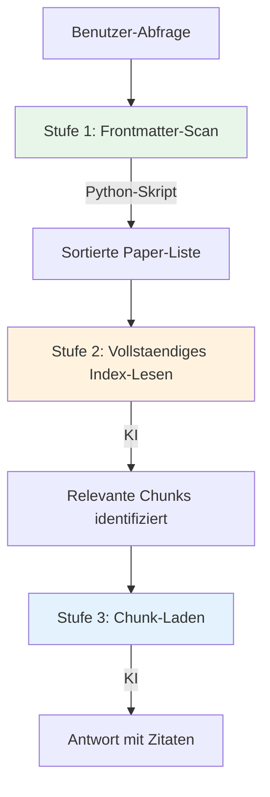
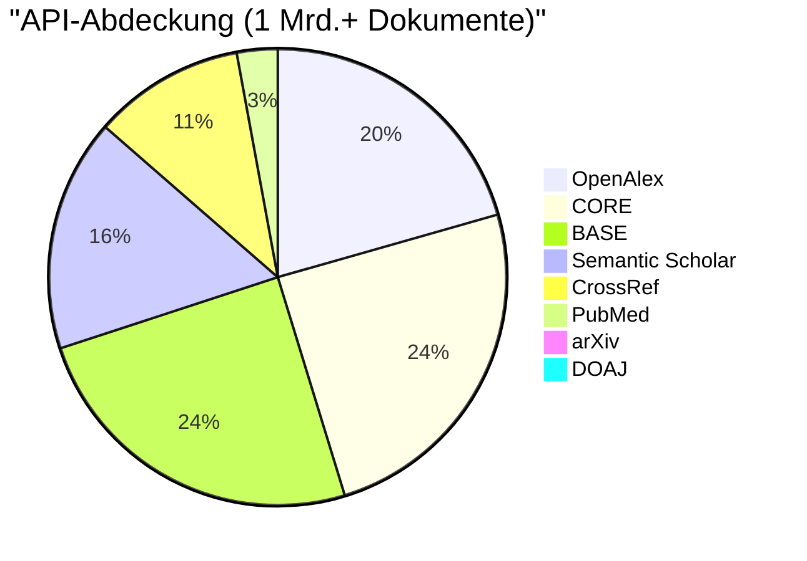
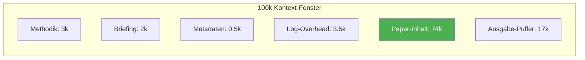

# Dokumentation des Forschungsalgorithmus

> Umfassende Dokumentation der Nexus Research Pipeline zur Analyse und Synthese akademischer Paper.

---

## Uebersicht

Der Nexus Forschungsalgorithmus ist eine ausgefeilte mehrphasige Pipeline, die die Entdeckung, Beschaffung, Analyse und Synthese akademischer Paper automatisiert. Er besteht aus **9 miteinander verbundenen Skills**, die zusammenarbeiten, um eine Forschungsfrage in umsetzbare Erkenntnisse zu transformieren.

---

## Systemarchitektur



---

## Vollstaendiger Prozessablauf

```mermaid
flowchart TD
    Start([Benutzer: Forschungsfrage]) --> Init[Projekt initialisieren]

    subgraph Phase1["Phase 1: Planung & Beschaffung"]
        Init --> Define[Forschungsfrage definieren]
        Define --> Brief[_briefing.md erstellen]
        Brief --> Search[Akademische APIs durchsuchen]
        Search --> Results[_search_results.md]
        Results --> Review[KI Abstract-Bewertung]
        Review --> Abstract[_abstract_reviews.md]
        Abstract --> Select[Benutzer Paper-Auswahl]
        Select --> Gate1{Auswahl-Gate}
        Gate1 -->|Genehmigt| Download[Paper herunterladen]
        Gate1 -->|Aendern| Select
        Download --> Preprocess[PDF zu Markdown Chunks]
        Preprocess --> Kit[Analyse-Kit generieren]
        Kit --> Ready{Bereitschafts-Gate}
    end

    subgraph Phase2["Phase 2: Analyse & Synthese"]
        Ready -->|Bereit| Validate1[Bereitschaft validieren]
        Validate1 --> Analyze[Analyse-Subagenten starten]
        Analyze --> Index[index.md pro Paper]
        Index --> Validate2[Analyse-Logs validieren]
        Validate2 --> Synth[Synthese generieren]
        Synth --> Validate3[Synthese validieren]
        Validate3 --> Complete[Projekt abschliessen]
    end

    Complete --> End([Forschungsergebnisse])

    style Phase1 fill:#E8F5E9
    style Phase2 fill:#E3F2FD
```



---

## Skills-Uebersicht

### Kern-Skills

| Skill | Zweck | Trigger-Schluesselwoerter |
|-------|-------|---------------------------|
| `create-research-project` | Phase 1 Orchestrator | "create research project", "new research" |
| `execute-research-project` | Phase 2 Orchestrator | "execute research project", "run analysis" |
| `paper-search` | 9 akademische APIs durchsuchen | "find paper", "search paper" |
| `pdf-preprocess` | PDFs zu Markdown konvertieren | "preprocess pdf", "chunk pdf" |
| `paper-analyze` | Paper-Analyse orchestrieren | "analyze papers", "process papers" |
| `paper-analyze-core` | Analyse-Methodik | *Nur interne Verwendung* |
| `paper-synthesize` | Paper-uebergreifende Synthese | "synthesize collection" |
| `paper-query` | Analysierte Paper abfragen | "query papers", "find papers about" |
| `paper-manage` | Sammlungen verwalten | "list collections", "paper stats" |

---

## Phase 1: Planung & Beschaffung

### Workflow-Diagramm



### Schritt-Details

#### Schritt 1-3: Forschungsdefinition
- Nexus-Projektstruktur erstellen
- Interaktive Definition der Forschungsfrage
- `_briefing.md` mit Extraktionsschema erstellen

#### Schritt 4-6: Paper-Auswahl
- KI bewertet Abstracts mit Punktzahl (1-5)
- Domaenen-Uebereinstimmung, FF-Passung, Methodik-Relevanz, Aktualitaet
- Benutzer genehmigt finale Auswahl

#### Schritt 7-9: Beschaffung
- Automatisierter Batch-Download mit Fallback
- URL-Prioritaet: arXiv > Semantic Scholar > Unpaywall > Direkt
- PDF-Vorverarbeitung zu Markdown-Chunks (max. 1000 Zeilen/Chunk)

---

## Phase 2: Analyse & Synthese

### Workflow-Diagramm



### Analyse-Methodik (7 Schritte)



#### Anti-Halluzinations-Massnahmen
- **3-Punkt-Evidenz-Aufzeichnung**: Start (100 Zeichen), Mitte (100 Zeichen), Ende (100 Zeichen)
- **SHA256-Hash**: Vollstaendige Chunk-Inhaltsverifizierung
- **Chunk:Zeilen-Referenzen**: Jede Extraktion muss Quellposition zitieren

---

## Datenfluss-Architektur



---

## Projektstruktur

```
02-projects/NN-{slug}/
├── 01-planning/
│   ├── overview.md          # Projekt-Metadaten
│   ├── plan.md              # Orchestrator-Anweisungen
│   └── steps.md             # Fortschritts-Checkboxen
├── 02-resources/
│   ├── _briefing.md         # Forschungsfrage + Schema
│   ├── _analysis_kit.md     # Subagent-Kontext
│   ├── _search_results.md   # API-Suchergebnisse
│   ├── _abstract_reviews.md # KI-Bewertungen
│   └── papers/
│       └── {paper}/
│           ├── {paper}.pdf
│           ├── {paper}_1.md, _2.md, ...
│           ├── _metadata.json
│           ├── _analysis_log.md
│           └── index.md
├── 03-working/
│   └── _selection_log.md    # Genehmigte Paper
└── 04-outputs/
    ├── _synthesis.md        # Paper-uebergreifende Synthese
    ├── _validation_report.md
    └── _quality_metrics.md
```

---

## Validierungssystem

### Drei-Stufen-Validierung



### Validierungsschwellenwerte

| Metrik | Bestanden | Warnung | Fehlgeschlagen |
|--------|-----------|---------|----------------|
| Frontmatter-Vollstaendigkeit | 100% | <100% | Erforderliche fehlen |
| Paper-Referenz-Genauigkeit | 100% | >90% | <90% |
| Stichproben-Verifizierung | >90% | 70-90% | <70% |
| Abdeckung | >80% | 60-80% | <60% |

---

## Paper-Abfragesystem

### 3-Stufen Progressive Offenlegung



### Ranking-Faktoren

| Faktor | Gewichtung | Quelle |
|--------|------------|--------|
| relevance_triggers Treffer | 3x | index.md YAML |
| topics Treffer | 2x | index.md YAML |
| methods Treffer | 2x | index.md YAML |
| key_findings Treffer | 1x | index.md YAML |
| Jahr (neuere bevorzugt) | 0.5x | index.md YAML |

---

## Akademische API-Abdeckung



| API | Dokumente | Optimal fuer |
|-----|-----------|--------------|
| Semantic Scholar | 200M+ | CS/KI, Zitationen |
| OpenAlex | 250M+ | Breite Akademie |
| arXiv | 2M+ | CS/Physik/Mathematik Preprints |
| CrossRef | 130M+ | DOI-Metadaten |
| PubMed | 35M+ | Biomedizin |
| CORE | 300M+ | UK/EU Forschung |
| BASE | 300M+ | Deutscher Aggregator |
| DOAJ | 9M+ | Verifizierte OA-Zeitschriften |
| Unpaywall | - | OA-PDF-Suche via DOI |

---

## Token-Budget-Verwaltung



### Behandlung grosser Paper

- Paper > 75k Tokens werden in Teile aufgeteilt
- Jeder Teil wird von separatem Subagent analysiert
- Merge-Subagent kombiniert Teil-Indizes
- Finaler vereinheitlichter index.md wird generiert

---

## Fehlerbehandlung

### Nach Phase

| Phase | Fehler | Aktion |
|-------|--------|--------|
| Suche | API Rate-Limit | Warten und wiederholen |
| Download | Alle kostenpflichtig | arXiv-Alternativen vorschlagen |
| Vorverarbeitung | PDF beschaedigt | Ueberspringen, Fehler protokollieren |
| Analyse | Subagent schlaegt fehl | Einmal wiederholen, dann Fehler protokollieren |
| Validierung | Evidenz-Mismatch | Erneut analysieren oder ausschliessen |
| Synthese | <3 Paper | Vor begrenzter Synthese warnen |

---

## Versionshistorie

| Version | Datum | Aenderungen |
|---------|-------|-------------|
| 4.0 | 2025-12-19 | Analyse-Kit, Orchestrator-Templates, Phase 4.5 Validierung hinzugefuegt |
| 2.2 | 2025-12-19 | Chunk:Zeilen Extraktions-Tracking, Zwei-Stufen-Detail-Strategie hinzugefuegt |
| 2.1 | 2025-12-19 | 3-Punkt Anti-Halluzinations-Sampling hinzugefuegt |
| 2.0 | 2025-12-19 | Planung/Beschaffung von Analyse/Synthese getrennt |

---

**Zuletzt aktualisiert**: 2025-12-27
