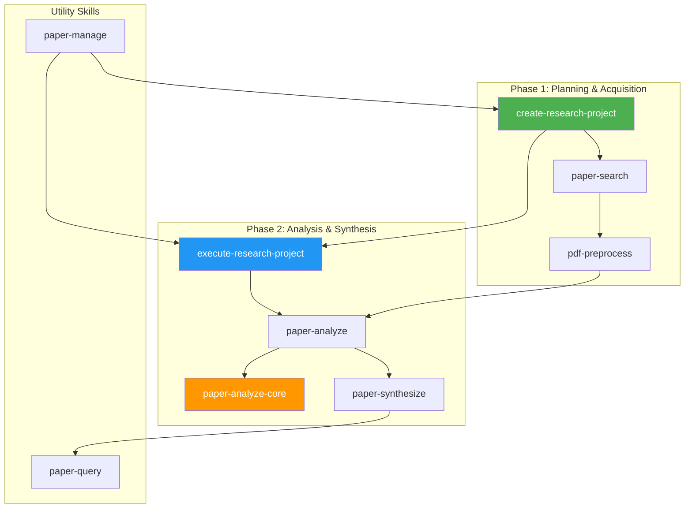
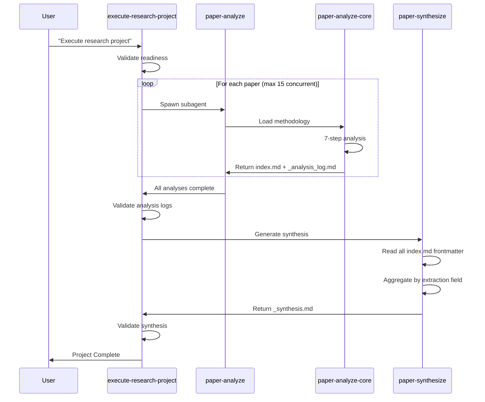

# Research Algorithm Documentation

> Comprehensive documentation of the Nexus Research Pipeline for academic paper analysis and synthesis.

---

## Overview

The Nexus Research Algorithm is a sophisticated multi-phase pipeline that automates the discovery, acquisition, analysis, and synthesis of academic papers. It consists of **9 interconnected skills** that work together to transform a research question into actionable insights.

---

## System Architecture



---

## Complete Process Flow

```mermaid
flowchart TD
    Start([User: Research Question]) --> Init[Initialize Project]

    subgraph Phase1["Phase 1: Planning & Acquisition (Steps 0-13)"]
        Init --> Define[Step 2: Define Research Question]
        Define --> Brief[Create _briefing.md]
        Brief --> Search[Step 3: Search Academic APIs]
        Search --> Results[_search_results.md]
        Results --> Review[Step 4: AI Abstract Review]
        Review --> Abstract[_abstract_reviews.md]
        Abstract --> Select[Step 5: User Paper Selection]
        Select --> Gate1{Step 6: Selection Gate}
        Gate1 -->|Approved| Download[Step 7: Download Papers]
        Gate1 -->|Modify| Select
        Download --> Preprocess[Step 8: PDF to Markdown Chunks]
        Preprocess --> Kit[Step 10: Generate Analysis Kit]
        Kit --> Guide[Step 11: Generate Extraction Guide]
        Guide --> Orch[Step 12: Generate Orchestrator Instructions]
        Orch --> Ready{Step 13: Readiness Gate}
    end

    subgraph Phase2["Phase 2: Analysis & Synthesis (Steps 0-5)"]
        Ready -->|Ready| Validate1[Step 1: Validate Readiness]
        Validate1 --> Plan[Step 1.5: Read Pre-Calculated Allocation]
        Plan --> Analyze[Step 2: Spawn Subagents per Allocation]
        Analyze --> Index[index.md per Paper]
        Index --> Validate2[Step 3: Validate Analysis Logs]
        Validate2 --> Synth[Step 4: Generate Synthesis]
        Synth --> Validate3[Step 4.5: Validate Synthesis]
        Validate3 --> Complete[Step 5: Mark Project Complete]
    end

    Complete --> End([Research Outputs])

    style Phase1 fill:#E8F5E9
    style Phase2 fill:#E3F2FD
```



---

## Skills Overview

### Core Skills

| Skill | Purpose | Trigger Keywords |
|-------|---------|------------------|
| `create-research-project` | Phase 1 orchestrator | "create research project", "new research" |
| `execute-research-project` | Phase 2 orchestrator | "execute research project", "run analysis" |
| `paper-search` | Search 9 academic APIs | "find paper", "search paper" |
| `pdf-preprocess` | Convert PDFs to markdown | "preprocess pdf", "chunk pdf" |
| `paper-analyze` | Orchestrate paper analysis | "analyze papers", "process papers" |
| `paper-analyze-core` | Analysis methodology | *Internal use only* |
| `paper-synthesize` | Cross-paper synthesis | "synthesize collection" |
| `paper-query` | Query analyzed papers | "query papers", "find papers about" |
| `paper-manage` | Manage collections | "list collections", "paper stats" |

---

## Phase 1: Planning & Acquisition

### Workflow Diagram


### Step Details

#### Steps 0-3: Research Definition
- **Step 0**: Initialize TodoWrite task tracking
- **Step 1**: Create Nexus project structure
- **Step 2**: Interactive research question definition → `_briefing.md`
- **Step 3**: Search academic APIs → `_search_results.md`

#### Steps 4-6: Paper Selection
- **Step 4**: AI reviews abstracts with scoring (1-5) → `_abstract_reviews.md`
- **Step 5**: User selection interface → `_selection_log.md`
- **Step 6**: Selection Gate (user approves papers)

#### Steps 7-9: Acquisition
- **Step 7**: Batch download with multi-source fallback
- **Step 8**: PDF preprocessing to markdown chunks (max 1000 lines/chunk)
- **Step 9**: Acquisition Report + User Gate

#### Steps 10-13: Readiness Gate (NEW in v5.0)
- **Step 10**: Generate `_analysis_kit.md` (subagent context) + validate
- **Step 11**: Generate `_extraction_guide.md` (field examples + vocabulary) + validate
- **Step 12**: Calculate subagent allocation + Generate orchestrator instructions in `plan.md`
  - 12.1: Calculate allocation based on chunk counts (see Subagent Planning table)
  - 12.2: Write allocation table to plan.md
  - 12.3: Generate subagent prompts with pre-calculated splits
- **Step 13**: Confirm ready for execution → Handoff to Phase 2

---

## Phase 2: Analysis & Synthesis

### Workflow Diagram



### Analysis Methodology (7 Steps)


#### Anti-Hallucination Measures
- **3-Point Evidence Recording**: Start (100 chars), Mid (100 chars), End (100 chars)
- **SHA256 Hash**: Full chunk content verification
- **Chunk:Line References**: Every extraction must cite source location

---

## Data Flow Architecture


---

## Project Structure

```
02-projects/NN-{slug}/
├── 01-planning/
│   ├── overview.md          # Project metadata
│   ├── plan.md              # Orchestrator instructions + subagent prompts
│   └── steps.md             # Progress checkboxes
├── 02-resources/
│   ├── _briefing.md         # Research question + schema
│   ├── _analysis_kit.md     # Subagent context (consolidated)
│   ├── _extraction_guide.md # Field examples + controlled vocabulary
│   ├── _search_results.md   # API search results
│   ├── _abstract_reviews.md # AI assessments
│   └── papers/
│       └── {paper}/
│           ├── {paper}.pdf
│           ├── {paper}_1.md, _2.md, ...
│           ├── _metadata.json
│           ├── _analysis_log.md
│           └── index.md
├── 03-working/
│   ├── _selection_log.md    # Approved papers + acquisition status
│   └── _resume.md           # Context recovery checkpoint
└── 04-outputs/
    ├── _synthesis.md        # Cross-paper synthesis
    ├── _synthesis_validation.md  # Synthesis spot-check results
    ├── _validation_report.md
    └── _quality_metrics.md
```

---

## Validation System

### Three-Level Validation


### Validation Thresholds

| Metric | Pass | Warn | Fail |
|--------|------|------|------|
| Frontmatter completeness | 100% | <100% | Missing required |
| Paper reference accuracy | 100% | >90% | <90% |
| Spot-check verification | >90% | 70-90% | <70% |
| Coverage | >80% | 60-80% | <60% |

---

## Paper Query System

### 3-Level Progressive Disclosure


### Ranking Factors

| Factor | Weight | Source |
|--------|--------|--------|
| relevance_triggers match | 3x | index.md YAML |
| topics match | 2x | index.md YAML |
| methods match | 2x | index.md YAML |
| key_findings match | 1x | index.md YAML |
| year (newer preferred) | 0.5x | index.md YAML |

---

## Academic API Coverage


| API | Documents | Best For |
|-----|-----------|----------|
| Semantic Scholar | 200M+ | CS/AI, citations |
| OpenAlex | 250M+ | Broad academic |
| arXiv | 2M+ | CS/Physics/Math preprints |
| CrossRef | 130M+ | DOI metadata |
| PubMed | 35M+ | Biomedical |
| CORE | 300M+ | UK/EU research |
| BASE | 300M+ | German aggregator |
| DOAJ | 9M+ | Verified OA journals |
| Unpaywall | - | OA PDF lookup via DOI |

---

## Token Budget Management


### Large Paper Handling

- Papers > 75k tokens are split into parts
- Each part analyzed by separate subagent
- Merge subagent combines partial indexes
- Final unified index.md generated

---

## Error Handling

### By Phase

| Phase | Error | Action |
|-------|-------|--------|
| Search | API rate limit | Wait and retry |
| Download | All paywalled | Suggest arXiv alternatives |
| Preprocess | PDF corrupted | Skip, log error |
| Analysis | Subagent fails | Retry once, then log failure |
| Validation | Evidence mismatch | Re-analyze or exclude |
| Synthesis | <3 papers | Warn about limited synthesis |

---

## Concurrency & Performance

| Setting | Value | Notes |
|---------|-------|-------|
| Max concurrent subagents | 15 | Parallel analysis for speed |
| Timeout per paper | 5 min | Generous for large papers |
| Retry on failure | 1 | Single retry before exclusion |
| Min papers for synthesis | 3 | Warn if fewer |

### Subagent Planning (Phase 1 Step 12)

**Allocation is calculated ONCE in Phase 1 Step 12 and written to plan.md.**
Phase 2 reads the pre-calculated allocation - it does NOT recalculate.

**Token estimation**: Each chunk ≈ 10-15k tokens (1000 lines × ~50 chars/line)
**Usable budget**: 74k tokens per subagent (after 26k methodology overhead)

| Chunk Count | Est. Tokens | Subagents | Strategy |
|-------------|-------------|-----------|----------|
| 1-3 chunks | <45k | 1 | Single subagent analyzes all |
| 4-6 chunks | 45k-74k | 1 | Single subagent (near limit) |
| 7-12 chunks | 74k-150k | 2 | Split at chunk 6, merge after |
| 13-18 chunks | 150k-220k | 3 | Split into 6-chunk segments |
| 19+ chunks | >220k | 4+ | Split into 5-6 chunk segments |

**Allocation table in plan.md** (written by Phase 1 Step 12):
```markdown
## Subagent Allocation Plan

| Paper ID | Chunks | Est. Tokens | Subagents | Splits |
|----------|--------|-------------|-----------|--------|
| Paper_A  | 4      | ~47,000     | 1         | 1-4    |
| Paper_B  | 10     | ~120,000    | 2         | 1-6, 7-10 |

**Total subagents**: 3
```

---

## Context Recovery

The pipeline maintains `_resume.md` for context recovery after compaction:

```yaml
---
updated: "{timestamp}"
phase: "definition|selection|acquisition|readiness|analysis|synthesis"
project_id: "{project_id}"
step: {current_step_number}
---

# Resume Context

## Current State
- Phase: {current phase}
- Step: {step_number} - {step_name}
- Papers analyzed: {N}/{total}

## Next Actions
1. {immediate next step}
2. {following step}
```

**Update triggers**:
- Context usage reaches ~60%
- After completing each major step
- After user approval gates

---

## Version History

| Version | Date | Changes |
|---------|------|---------|
| 5.0 | 2025-12-28 | Added Steps 10-13 (analysis kit, extraction guide, orchestrator), 15 concurrent subagents, _resume.md context recovery, subagent planning |
| 4.0 | 2025-12-19 | Added analysis kit, orchestrator templates, Phase 4.5 validation |
| 2.2 | 2025-12-19 | Added chunk:line extraction tracking, two-tier detail strategy |
| 2.1 | 2025-12-19 | Added 3-point anti-hallucination sampling |
| 2.0 | 2025-12-19 | Separated planning/acquisition from analysis/synthesis |

---

**Last Updated**: 2025-12-28
