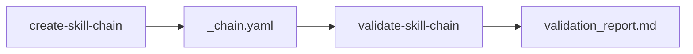

# Validation Report: Project 04 vs Project 05

**Date**: 2025-12-28
**Projects Compared**:
- **Project 04**: Skill-Chain Validation System (PLANNING)
- **Project 05**: Create Skill-Chain Skill (IN PROGRESS)

---

## Executive Summary

| Aspect | Status | Notes |
|--------|--------|-------|
| Contract Schema Alignment | **ALIGNED** | Project 05 implements the schema Project 04 designed |
| Output Format Compatibility | **ALIGNED** | `_chain.yaml` format matches Project 04 expectations |
| Validation Script Integration | **READY** | Project 05 generates validation/ folder for scripts |
| Project 04 Implementation | **NOT STARTED** | validate-skill-chain skill not yet created |

**Conclusion**: Project 05 (create-skill-chain) is complete and generates contracts that Project 04 (validate-skill-chain) will consume. Project 04 needs to be built to use these contracts.

---

## Detailed Comparison

### 1. Contract Schema

| Feature | Project 04 Design | Project 05 Implementation | Match |
|---------|-------------------|---------------------------|-------|
| Contract location | `contracts/{chain}.yaml` | `_chain.yaml` in chain root | **DIFFERENT** |
| Skills array | id, phase, produces, requires | id, phase, type, path, produces, requires | **ENHANCED** |
| Produces spec | path, required, validates | path, required, schema, min_count, validates | **ENHANCED** |
| Gates | checks array | after_phase + checks array | **ENHANCED** |
| Schemas | required_fields, optional_fields | Same | **MATCH** |
| Structure section | Not in original design | Added (type, parent_skill, subfolders) | **ADDED** |

**Assessment**: Project 05 **extends** the original Project 04 schema with:
- `structure` section for nested skill-chains
- `type` field for skill categorization
- `path` field for skill locations
- `min_count` for glob patterns

### 2. Contract Location

| Project | Location | Rationale |
|---------|----------|-----------|
| Project 04 (original) | `03-skills/validate-skill-chain/contracts/{chain}.yaml` | Central location |
| Project 05 (implemented) | `03-skills/{chain-name}/_chain.yaml` | Co-located with chain |

**Recommendation**: Update Project 04 to read from `_chain.yaml` in the chain root. This is better because:
1. Contract lives with the skill-chain it defines
2. No need for separate contracts folder
3. Follows convention: `_` prefix for meta-files

### 3. Validation Rules

Project 05's contract-schema.md defines these validation rule types:

| Rule Type | Syntax | Project 04 Support Needed |
|-----------|--------|---------------------------|
| File existence | `required: true` | Check file exists |
| Glob min count | `min_count: 1` | Count glob matches >= min_count |
| YAML frontmatter | `has_yaml_frontmatter: true` | Parse YAML header |
| Field equals | `field: X, equals: Y` | Check field value |
| Field in list | `field: X, in: [a,b,c]` | Check field in allowed values |

### 4. Gate Expressions

Project 05 defines gate expressions that Project 04 must parse:

| Expression Type | Example | Parser Needed |
|-----------------|---------|---------------|
| File exists | `"_briefing.md exists"` | Simple |
| Count comparison | `"papers_with_chunks > 0"` | Requires variable resolution |
| Field comparison | `"overview.md status == READY_FOR_EXECUTION"` | Requires file read + YAML parse |
| Complex conditions | `"validation pass rate > 80%"` | Custom logic |

### 5. Generated Artifacts

Project 05 generates these files that Project 04 should validate:

| Artifact | Path | Validation Approach |
|----------|------|---------------------|
| Parent SKILL.md | `{chain}/SKILL.md` | Check routing table, triggers |
| Contract | `{chain}/_chain.yaml` | Validate schema |
| Documentation | `{chain}/_index.md` | Optional, check Mermaid syntax |
| Orchestrators | `{chain}/orchestrators/*/SKILL.md` | Check frontmatter |
| Sub-skills | `{chain}/skills/*/SKILL.md` | Check frontmatter |
| Shared | `{chain}/shared/*/SKILL.md` | Check "DO NOT LOAD" warning |
| Validation scripts | `{chain}/validation/` | Check they exist |

---

## Gap Analysis

### Project 04 Must Implement

1. **Contract Loader**
   - Read `_chain.yaml` from chain root (not `contracts/` folder)
   - Parse enhanced schema with `structure`, `type`, `path` fields
   - Handle `min_count` for glob patterns

2. **Validation Logic**
   - File existence checks
   - Glob pattern matching with min_count
   - YAML frontmatter parsing
   - Field value validation (equals, in)

3. **Gate Expression Parser**
   - `{file} exists` syntax
   - `{variable} > N` syntax
   - `{file} {field} == {value}` syntax

4. **Report Generator**
   - Markdown output per Project 04 plan
   - Pass/fail/pending status per skill
   - Actionable fix recommendations

### Schema Changes Required

Project 04's original schema in plan.md:
```yaml
# Original (Project 04)
skills:
  - id: string
    phase: int
    type: orchestrator|subskill|shared
    produces:
      - path: string
        required: bool
        validates: [...]
```

Project 05's implemented schema:
```yaml
# Implemented (Project 05)
skills:
  - id: string
    phase: int
    type: orchestrator|sub-skill|shared-methodology
    path: string                    # NEW: skill location
    description: string             # NEW: skill purpose
    uses: [string]                  # NEW: for orchestrators
    called_by: string               # NEW: for sub-skills
    uses_shared: [string]           # NEW: shared dependencies
    produces:
      - path: string
        required: bool
        schema: string              # NEW: schema reference
        min_count: int              # NEW: for globs
        validates: [...]
```

**Action**: Project 04 must accept the enhanced schema.

---

## Recommendations

### Immediate Actions

1. **Update Project 04 steps.md** - Mark schema changes as decided
2. **Change contract location** - Read from `{chain}/_chain.yaml` not `contracts/`
3. **Update contract_loader.py spec** - Support enhanced schema

### Implementation Order

1. **Build validate-skill-chain** with the enhanced schema
2. **Test against research-pipeline** - Use `03-skills/research-pipeline/_chain.yaml`
3. **Test against generated chain** - Generate interview-analysis, validate it

### Integration Points



---

## Test Cases for Project 04

When Project 04 is built, test against:

### 1. Research Pipeline (Existing)
- Path: `03-skills/research-pipeline/_chain.yaml`
- Expected: 9 skills, 2 phases, 2 gates
- Test: All skills exist at defined paths

### 2. Interview Analysis (To Generate)
```bash
python 03-skills/create-skill-chain/scripts/generate_chain.py \
  --name "interview-analysis" \
  --config-file 03-skills/create-skill-chain/references/examples/interview-analysis-config.json
```
- Expected: 7 skills, 2 phases, 1-2 gates
- Test: Structure matches generated contract

### 3. Partial Project (02-ontologies-research)
- Path: `02-projects/02-ontologies-research/`
- Expected: Partial completion (29%)
- Test: Correct identification of missing outputs

---

## Files Created by Project 05

| File | Status | Purpose |
|------|--------|---------|
| `SKILL.md` | Created | 10-step interactive workflow |
| `scripts/generate_chain.py` | Created | Main orchestrator |
| `scripts/generate_contract.py` | Created | Generate _chain.yaml |
| `scripts/generate_parent_skill.py` | Created | Generate parent router |
| `scripts/generate_orchestrator.py` | Created | Generate orchestrators |
| `scripts/generate_subskill_stub.py` | Created | Generate sub-skills |
| `scripts/generate_shared_methodology.py` | Created | Generate shared skills |
| `scripts/generate_chain_docs.py` | Created | Generate _index.md |
| `scripts/migrate_flat_to_nested.py` | Created | Migration helper |
| `templates/*.j2` (6 files) | Created | Jinja2 templates |
| `references/contract-schema.md` | Created | Schema documentation |
| `references/nested-skill-patterns.md` | Created | Best practices |
| `references/examples/interview-analysis-config.json` | Created | Example config |

---

## Conclusion

**Project 05 is complete** and generates:
- Complete nested skill-chain structures
- `_chain.yaml` contracts with full validation specs
- Documentation with Mermaid diagrams

**Project 04 is not started** but the design is compatible:
- Contract schema is defined and enhanced
- Validation rules are specified
- Integration points are clear

**Next Step**: Build Project 04's `validate-skill-chain` skill to consume the contracts generated by Project 05.

---

**Validated By**: Nexus Agent
**Date**: 2025-12-28