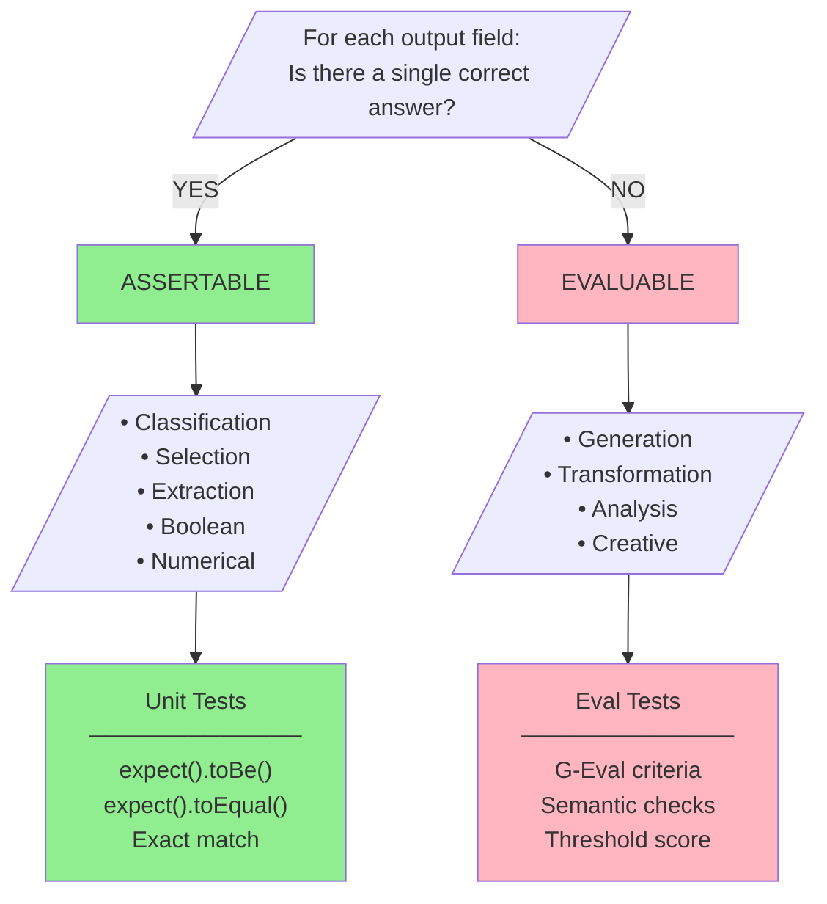
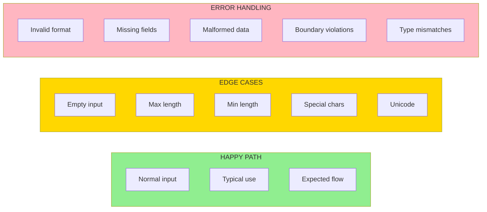
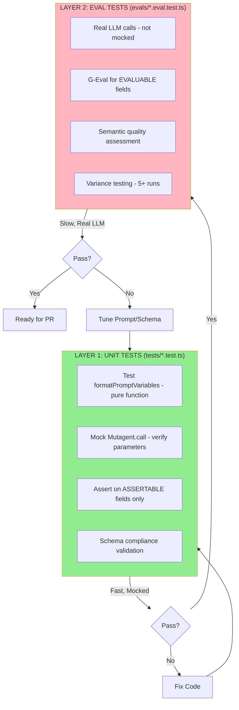
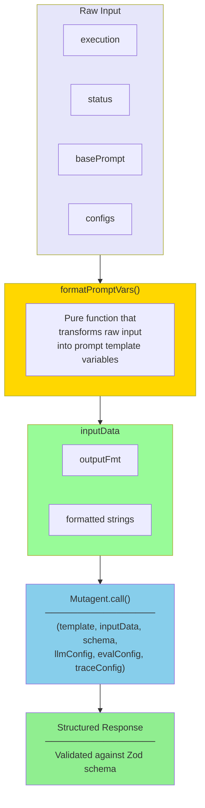

# OptiLoop Core Principles

Fundamental principles for LLM feature development, testing, and evaluation.

---

## 1. Assertable vs Evaluable Fields

The most critical distinction in LLM feature testing.

### Decision Flowchart



### Output Type Categories

| Category           | Examples                             | Assertable? | Test Method                                |
| ------------------ | ------------------------------------ | ----------- | ------------------------------------------ |
| **Classification** | Category, Label, Type, Sentiment     | Yes         | `expect(result.category).toBe('expected')` |
| **Selection**      | Choice from enum, Pick from options  | Yes         | `expect(result.choice).toBe('optionA')`    |
| **Extraction**     | Date, Name, ID, Entity, Phone        | Yes         | `expect(result.extracted).toBe('value')`   |
| **Boolean**        | Yes/No, True/False, IsValid          | Yes         | `expect(result.flag).toBe(true)`           |
| **Numerical**      | Count, Score, Percentage, Total      | Yes         | `expect(result.value).toBeCloseTo(42)`     |
| **Generation**     | Summary, Explanation, Description    | No          | G-Eval with quality criteria               |
| **Transformation** | Rewrite, Translation, Paraphrase     | No          | G-Eval for semantic equivalence            |
| **Analysis**       | Reasoning, Insights, Recommendations | No          | Structural + semantic evaluation           |

---

## 2. Temperature Rule

**CRITICAL**: All production LLM features MUST use `temperature: 0`

```typescript
// CORRECT - Production
const llmConfig = {
	model: 'claude-sonnet-4-20250514',
	additionalConfig: {
		temperature: 0, // ALWAYS 0 for deterministic output
	},
};

// WRONG - Non-deterministic
const llmConfig = {
	model: 'claude-sonnet-4-20250514',
	additionalConfig: {
		temperature: 0.7, // NEVER in production
	},
};
```

Exception: Test case generation may use `temperature: 0.7` for diversity.

---

## 3. Schema Description Rule

**CRITICAL**: Every Zod field MUST have `.describe()`

The description guides the LLM's output generation. Without it, the model guesses field purpose.

```typescript
// CORRECT - Descriptive
const OutputSchema = z.object({
	category: z
		.enum(['urgent', 'normal', 'low'])
		.describe('Priority classification based on urgency indicators'),
	reasoning: z
		.string()
		.describe(
			'Step-by-step reasoning for classification. Minimum 5 sentences.'
		),
	confidence: z
		.number()
		.min(0)
		.max(1)
		.describe('Confidence score between 0 and 1'),
});

// WRONG - Missing descriptions
const OutputSchema = z.object({
	category: z.enum(['urgent', 'normal', 'low']),
	reasoning: z.string(),
	confidence: z.number(),
});
```

---

## 4. Output Format Placement

`{outputFormat}` MUST be at the END of either System or Human prompt.

```typescript
// CORRECT - At end of System prompt
const SYSTEM_PROMPT = `You are an expert analyzer.

## Task
Analyze the input and classify it.

## Guidelines
1. Consider all factors
2. Be thorough

{outputFormat}`;

// CORRECT - At end of Human prompt
const HUMAN_PROMPT = `## Input
{inputData}

{outputFormat}`;

// WRONG - Inline placement
const SYSTEM_PROMPT = `You are an expert. {outputFormat} Your task is to...`;
```

---

## 5. MECE Test Case Design

Test cases must be **M**utually **E**xclusive and **C**ollectively **E**xhaustive.

### Categories



### Principles

1. **Maximally Realistic**: Test cases mirror real-world scenarios
2. **Mutually Exclusive**: Each case tests a distinct aspect
3. **Collectively Exhaustive**: Cover the entire input/output space

---

## 6. Two-Layer Testing



### TDD Loop Commands

**CRITICAL**: Always run specific test files, not the full suite.

```bash
# Unit tests - fast, mocked
bun test tests/feature-name.test.ts

# Eval tests - slower, real LLM calls
bun test evals/feature-name.eval.test.ts

# Run specific test by name
bun test tests/feature-name.test.ts -t "should format variables"

# Watch mode for continuous TDD
bun test tests/feature-name.test.ts --watch
```

**Why specific files?**

- Fast feedback loops (seconds vs minutes)
- Focused on current work
- Avoids unrelated test failures blocking progress
- Real LLM calls in eval tests are expensive

---

## 7. Prompt Variable Flow



---

## 8. G-Eval Criteria Design

For evaluable fields, define clear criteria with thresholds:

```typescript
const evalConfig: EvalConfig = {
	stepName: 'FeatureEvaluation',
	evalMode: EvalMode.SYNC,
	evals: [
		createGEval('completeness', 'Output covers all key points from input', {
			threshold: 0.8,
			evaluationSteps: [
				'Identify key points in the input',
				'Check if each key point is addressed in output',
				'Score based on coverage percentage',
			],
		}),
		createGEval('accuracy', 'Output contains no factual errors', {
			threshold: 0.9,
			evaluationSteps: [
				'Extract factual claims from output',
				'Verify each claim against input',
				'Score based on accuracy rate',
			],
		}),
		createGEval('coherence', 'Output flows logically and is well-structured', {
			threshold: 0.8,
			evaluationSteps: [
				'Check logical flow between sentences',
				'Verify consistent reasoning',
				'Assess overall structure',
			],
		}),
	],
};
```

---

## 9. Hybrid Schema Pattern

Most real features have both assertable and evaluable fields:

```typescript
const OutputSchema = z.object({
	// ═══════════════════════════════════════════════
	// ASSERTABLE FIELDS - Test with exact/tolerance match
	// ═══════════════════════════════════════════════
	category: z
		.enum(['classification-a', 'classification-b', 'classification-c'])
		.describe('Primary classification category'),

	extractedEntity: z.string().describe('Main entity extracted from input'),

	confidence: z
		.number()
		.min(0)
		.max(1)
		.describe('Model confidence in classification'),

	isValid: z.boolean().describe('Whether input meets validity criteria'),

	// ═══════════════════════════════════════════════
	// EVALUABLE FIELDS - Test with G-Eval criteria
	// ═══════════════════════════════════════════════
	reasoning: z
		.string()
		.describe(
			'Step-by-step reasoning for the classification. Minimum 5 sentences.'
		),

	summary: z.string().describe('Concise summary of findings'),

	recommendations: z
		.array(z.string())
		.describe('List of actionable recommendations based on analysis'),
});
```

Test strategy:

```typescript
// Unit test - assertable fields
expect(result.category).toBe('classification-a');
expect(result.extractedEntity).toBe('expected-entity');
expect(result.confidence).toBeGreaterThan(0.8);
expect(result.isValid).toBe(true);

// Eval test - evaluable fields
// G-Eval for reasoning quality
// Structural checks for summary (length, contains keywords)
// Semantic eval for recommendations relevance
```

---

## 10. Variance Elimination Methodology

**The Analysis Chain Loop** - The iterative process for achieving 100% LLM output consistency.

### The Loop

```
┌─────────────────────────────────────────────────────────────────────────┐
│                      VARIANCE ELIMINATION LOOP                          │
├─────────────────────────────────────────────────────────────────────────┤
│                                                                         │
│   1. RUN ───────► 2. COMPARE ───────► 3. RECURSIVE WHY                 │
│   (N parallel      (Diff reasoning      (5 Whys on                      │
│    runs, temp=0)    fields)              divergence)                    │
│        ▲                                      │                         │
│        │                                      ▼                         │
│   6. VERIFY ◄──── 5. FIX ◄────────── 4. ROOT CAUSE                     │
│   (Re-run test)    (Surgical edit)     (Identify source)               │
│                                                                         │
│   Exit when: Consistency Score = 1.00                                  │
└─────────────────────────────────────────────────────────────────────────┘
```

### The `analysisReasoning` Comparison Technique

**Key Insight**: LLM reasoning divergence appears in the pre-reasoning field BEFORE manifesting in structured outputs.

When your schema includes a reasoning field (e.g., `analysisReasoning`, `thinking`, `reasoning`):

1. Run 3+ parallel executions with identical input
2. Diff the reasoning fields across runs
3. The first point of divergence reveals the ambiguity source
4. Apply Recursive Why Analysis to that divergence point

```typescript
// Find where reasoning diverges
const divergencePoint = findFirstDifference(
	run1.analysisReasoning,
	run2.analysisReasoning
);
// "...when determining if this is MISSING_SECTION vs INSTRUCTION_AMBIGUITY..."
// ↑ This reveals the category decision is the variance source
```

### MECE Category Design

**Variance often stems from non-mutually-exclusive categories.**

The fix: Priority-ordered decision criteria with explicit rules.

```typescript
/**
 * ## Category Selection Rules (Apply in Priority Order)
 *
 * 1. **CATEGORY_A**: Use ONLY when [specific condition].
 *    - Test: [explicit test to verify]
 *    - If [alternative condition] → Use CATEGORY_B instead
 *
 * 2. **CATEGORY_B**: Use when [another condition].
 *    - This is the DEFAULT when in doubt
 *    - Prefer this over CATEGORY_A when ambiguous
 */
```

### Granularity Rules

**Another variance source: multiple outputs for the same underlying issue.**

```typescript
/**
 * ## Granularity Rules
 *
 * 1. **One Source = One Output**: Each identified issue targets exactly ONE origin.
 *
 * 2. **Primary Origin Only**: When an issue manifests in BOTH locations,
 *    identify ONLY the PRIMARY origin. Do NOT create secondary entries.
 *
 * 3. **Deduplication**: Do not create multiple entries for the same underlying issue.
 */
```

### Schema Impact on Variance

**Missing schemas cause variance. Explicit Zod schemas reduce it.**

```typescript
// WRONG: Unspecified schema forces LLM to guess
const inputSchema = undefined;

// CORRECT: Explicit schema with descriptions
const InputSchema = z.object({
	field1: z.string().describe('Clear description of purpose'),
	field2: z.string().describe('Another clear description'),
});
```

### Variance Reduction Checklist

- [ ] Run 3+ parallel executions with temperature 0
- [ ] Compare reasoning/thinking fields for divergence
- [ ] Apply Recursive Why Analysis to divergence points
- [ ] Ensure all categories are MECE (mutually exclusive, collectively exhaustive)
- [ ] Add priority-ordered decision rules for overlapping concepts
- [ ] Add granularity rules to prevent duplication
- [ ] Ensure all schemas have explicit `.describe()` on every field
- [ ] Iterate until Consistency Score = 1.00
