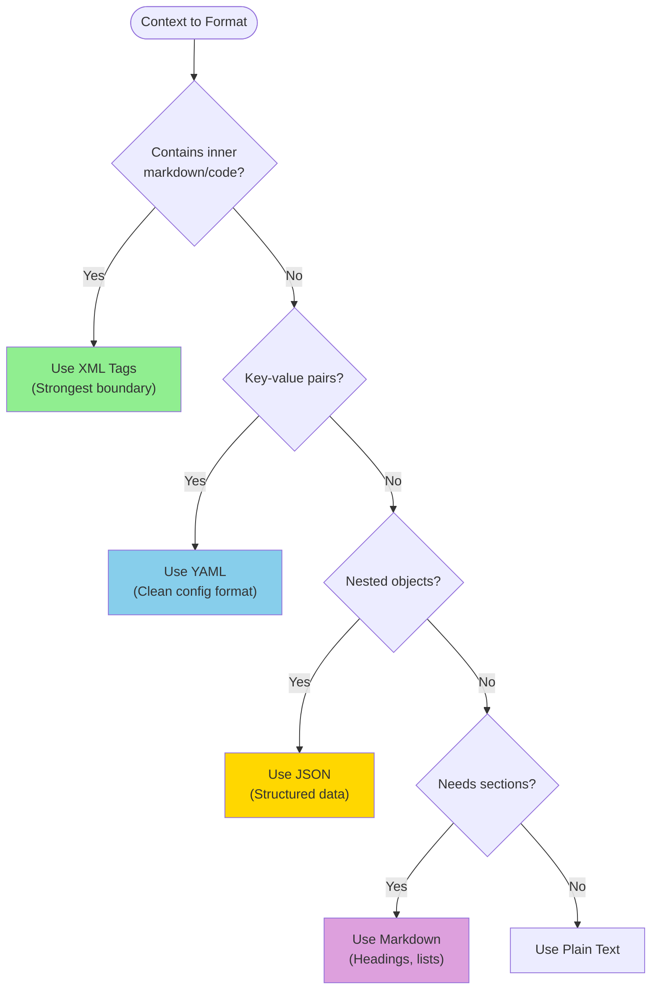

# LLM Feature Structure

Standard directory and file structure for LLM Features in the Mutagent codebase.

## Directory Structure

```bash
feature-module/
├── index.ts                     # Main exports
├── feature-llm.ts               # Main implementation with async feature function
├── feature-handler.ts           # Optional handler for integration
├── feature-prompt.ts            # LLM prompts using ChatPromptTemplate
├── feature-schema.ts            # Zod schemas for input/output validation
├── ai-developer-blog.md         # MANDATORY: Development log and decisions
├── tests/                       # Unit tests (Assertable)
│   ├── feature.test.ts          # Basic functionality tests
│   └── state-handler.test.ts    # Test state management
└── evals/                       # Evaluation framework (Quality)
    ├── index.ts
    ├── feature-evals.ts         # Evaluation implementation
    └── datasets/                # Test cases
        ├── index.ts
        ├── feature-cases.ts     # Base test cases
        └── generated-test-cases.json  # LLM-generated test cases
```

**CRITICAL**: The `ai-developer-blog.md` file is MANDATORY for every LLM feature. See SKILL.md for template and update rules.

---

## File Templates

### 1. Schema File (`feature-schema.ts`)

```typescript
import { z } from 'zod';

/**
 * Input schema for the feature
 * CRITICAL: Add .describe() to EVERY field
 */
export const FeatureInputSchema = z.object({
  // Define input fields with descriptions
  inputField: z.string().describe('Description of what this field contains'),
  optionalField: z.string().optional().describe('Optional field description'),
});

export type FeatureInput = z.infer<typeof FeatureInputSchema>;

/**
 * Output schema for the feature
 * CRITICAL: Add .describe() to EVERY field - this guides LLM output
 */
export const FeatureOutputSchema = z.object({
  // ASSERTABLE FIELDS (deterministic, testable with exact match)
  category: z.enum(['A', 'B', 'C']).describe('Classification result'),
  extracted: z.string().describe('Extracted entity from input'),
  confidence: z.number().min(0).max(1).describe('Confidence score 0-1'),

  // EVALUABLE FIELDS (generative, tested with G-Eval)
  reasoning: z.string().describe('Step-by-step reasoning. Minimum 5 sentences.'),
  summary: z.string().describe('Summary of analysis findings'),
});

export type FeatureOutput = z.infer<typeof FeatureOutputSchema>;
```

### 2. Prompt File (`feature-prompt.ts`)

```typescript
import {
  ChatPromptTemplate,
  SystemMessagePromptTemplate,
  HumanMessagePromptTemplate,
} from '@langchain/core/prompts';

/**
 * System Prompt Structure:
 * - Role: Define persona and capabilities
 * - Task: State primary objective (minimum 4 sentences)
 * - Task Context: Environment and background
 * - Reasoning Guidelines: Step-by-step thought process
 * - Output Requirements: Format constraints
 */
const FEATURE_SYSTEM_PROMPT = `You are a [Role Description].

## Task
[Primary objective - minimum 4 sentences explaining what to do]

## Task Context
[Environment, background, relevant information]

## Reasoning Guidelines
1. First, analyze [aspect 1]
2. Then, consider [aspect 2]
3. Finally, determine [aspect 3]

## Output Requirements
- [Requirement 1]
- [Requirement 2]

{outputFormat}`;

/**
 * Human Prompt Structure:
 * - Dynamic variables in {brackets}
 * - In-Prompt Context sections
 * - {outputFormat} at END if not in System
 */
const FEATURE_HUMAN_PROMPT = `## Input Data
{inputField}

## Additional Context
{contextField}`;

const featureSystemPrompt = SystemMessagePromptTemplate.fromTemplate(FEATURE_SYSTEM_PROMPT);
const featureHumanPrompt = HumanMessagePromptTemplate.fromTemplate(FEATURE_HUMAN_PROMPT);

export const featurePrompt = ChatPromptTemplate.fromMessages([
  featureSystemPrompt,
  featureHumanPrompt,
]);
```

### 3. LLM Function File (`feature-llm.ts`)

```typescript
import { Mutagent, type LLMConfig, type TraceConfig } from '@mutagent/core';
import { featurePrompt } from './feature-prompt.js';
import { FeatureOutputSchema, type FeatureOutput } from './feature-schema.js';
import { createLLMConfig } from '../../hooks/llm.js';

const DEFAULT_MODEL = 'claude-sonnet-4-20250514';

/**
 * STEP 1: Raw input for the feature function
 * (What callers provide - may be rich objects)
 */
export interface FeatureRawInput {
  document: DocumentObject;        // Complex object
  options: ProcessingOptions;      // Nested config
  llmConfig?: LLMConfig;
  traceConfig?: TraceConfig | null;
}

/**
 * STEP 2: Formatted prompt variables (matches template placeholders)
 * (What the prompt template needs - formatted strings)
 */
export interface FeaturePromptVariables {
  // System prompt variables
  outputFormat: string;
  // Human prompt variables
  documentContent: string;         // Formatted from document object
  processingInstructions: string;  // Formatted from options
}

/**
 * STEP 3: Format raw input into prompt variables
 * Pure function - easy to unit test
 *
 * CONTEXT FORMATTING RULES:
 * - Use XML tags for content with inner markdown/formatting
 * - Use Markdown for controlled, structured sections
 * - Use YAML for key-value configuration data
 * - Use JSON for nested object data
 */
export function formatPromptVariables(input: FeatureRawInput): FeaturePromptVariables {
  const { document, options } = input;

  return {
    outputFormat: '/* Auto-generated from Zod schema */',

    // XML wrapper - document may contain markdown headers, code blocks
    documentContent: `<document>
<title>${document.title}</title>
<content>
${document.content}
</content>
<metadata>
${JSON.stringify(document.metadata, null, 2)}
</metadata>
</document>`,

    // YAML format - clean key-value options
    processingInstructions: `processing_options:
  mode: ${options.mode}
  strictness: ${options.strictness}
  include_reasoning: ${options.includeReasoning}`,
  };
}

/**
 * STEP 4: Main feature function with output transformation
 * Pattern: Raw Input -> formatPromptVariables() -> Mutagent.call() -> Transform (if needed)
 */
export async function executeFeature(input: FeatureRawInput): Promise<FeatureOutput> {
  const {
    llmConfig = createLLMConfig(DEFAULT_MODEL),
    traceConfig,
  } = input;

  // Format raw input into prompt variables
  const inputData = formatPromptVariables(input);

  // Call LLM using static API
  const result = await Mutagent.call<FeatureOutput>(
    featurePrompt as any,                           // template (cast for version mismatch)
    inputData as unknown as Record<string, unknown>, // prompt variables
    FeatureOutputSchema as any,                      // responseType (Zod schema)
    llmConfig,                                       // LLM config
    undefined,                                       // evalConfig
    traceConfig                                      // traceConfig
  );

  // OUTPUT TRANSFORMATION (if LLM output differs from feature return type)
  // Scenario A: Direct return - types match
  return result as FeatureOutput;

  // Scenario B: Extract subset
  // return { category: result.category, confidence: result.confidence };

  // Scenario C: Enrich with computed fields
  // return { ...result, processedAt: new Date().toISOString() };
}
```

---

## Context Formatting Strategies

**CRITICAL**: How you format context directly impacts LLM attention and output quality.

### Format Selection Guide



### XML Tags - Strongest Boundary

**Use when**: Content has inner markdown, code, or formatting that could shift prompt attention.

```typescript
// ✅ CORRECT - XML isolates potentially conflicting content
function formatUserDocument(doc: UserDocument): string {
  return `<user_document>
<title>${doc.title}</title>
<body>
${doc.body}  // May contain # headers, **bold**, code blocks
</body>
</user_document>`;
}
```

**Why strongest**: XML tags create explicit boundaries that LLMs recognize. Inner content cannot "escape" and affect prompt structure.

### Markdown - Structured Sections

**Use when**: Content is under your control with no conflicting formatting.

```typescript
// ✅ CORRECT - Controlled content, clear hierarchy
function formatAnalysisSummary(analysis: Analysis): string {
  return `## Summary
${analysis.summary}

## Key Points
${analysis.points.map(p => `- ${p}`).join('\n')}`;
}
```

### YAML - Configuration Data

**Use when**: Presenting parameters, settings, or key-value data.

```typescript
// ✅ CORRECT - Clean parameter presentation
function formatExecutionConfig(config: ExecutionConfig): string {
  return `execution_parameters:
  model: ${config.model}
  temperature: ${config.temperature}
  max_tokens: ${config.maxTokens}

constraints:
  max_retries: ${config.maxRetries}
  timeout_ms: ${config.timeoutMs}`;
}
```

### JSON - Nested Objects

**Use when**: Presenting structured data with nesting.

```typescript
// ✅ CORRECT - Nested data structure
function formatInputData(data: InputData): string {
  return JSON.stringify(data, null, 2);
}
```

### Nested XML - Multiple Isolated Sections

**Use when**: Multiple content sections need isolation from each other.

```typescript
function formatExecutionBatch(executions: Execution[]): string {
  return `<execution_batch>
${executions.map((exec, i) => `
<execution index="${i + 1}" id="${exec.id}">
<input>
${exec.input}
</input>
<output>
${exec.output}
</output>
<metrics>
  score: ${exec.score}
  latency_ms: ${exec.latencyMs}
</metrics>
</execution>`).join('\n')}
</execution_batch>`;
}
```

---

## Mutagent.call() Static API

```typescript
const result = await Mutagent.call<ResponseType>(
  template,       // ChatPromptTemplate | string
  inputData,      // Record<string, unknown> - prompt variables
  responseType,   // z.ZodSchema - for structured output
  llmConfig,      // LLMConfig - model, provider, temperature
  evalConfig,     // EvalConfig | null - evaluation criteria
  traceConfig     // TraceConfig | null - observability
);
```

### Type Cast Workarounds

Due to `@langchain/core` and `zod` version mismatches in the monorepo:

```typescript
template as any                                    // ChatPromptTemplate
inputData as unknown as Record<string, unknown>    // Record type
schema as any                                      // Zod schema
result as unknown as FeatureOutput                 // Return type
```

---

## Common Mistakes to Avoid

1. **Missing `.describe()`** - Every Zod field MUST have a description
2. **`{outputFormat}` placement** - Must be at END of System OR Human prompt
3. **Duplicate variables** - Never include same variable in both prompts
4. **Direct provider calls** - Always use `Mutagent.call()`, never direct SDK
5. **Non-zero temperature** - Production features must use `temperature: 0`
6. **Testing generative fields** - Don't use `expect().toBe()` for generative output
