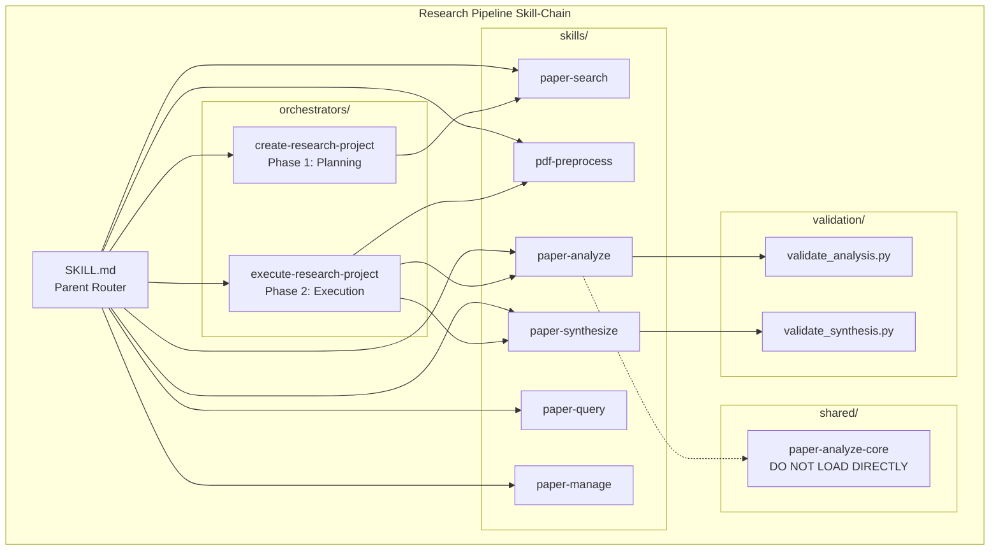
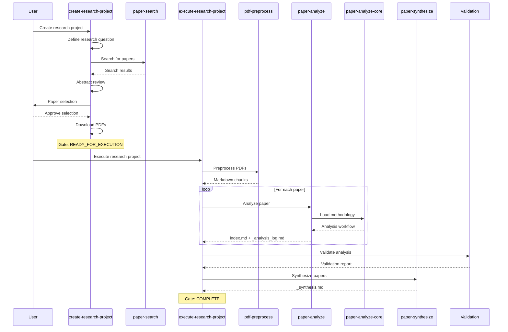

# Research Pipeline - Skill-Chain Documentation

**Generated**: 2025-12-27
**Version**: 2.0 (Nested Architecture)

---

## Overview

The Research Pipeline is a nested skill-chain for academic paper research, analysis, and synthesis. It provides a complete workflow from research question definition to cross-paper synthesis.

## Architecture Diagram



## Process Flow



## Skill Inventory

### Orchestrators (User Entry Points)

| Skill | Path | Purpose |
|-------|------|---------|
| create-research-project | `orchestrators/create-research-project/` | Phase 1: Define research, search, select, download |
| execute-research-project | `orchestrators/execute-research-project/` | Phase 2: Preprocess, analyze, validate, synthesize |

### Sub-Skills

| Skill | Path | Purpose |
|-------|------|---------|
| paper-search | `skills/paper-search/` | Search 9 academic APIs |
| pdf-preprocess | `skills/pdf-preprocess/` | Convert PDF to markdown chunks |
| paper-analyze | `skills/paper-analyze/` | Spawn subagents for analysis |
| paper-synthesize | `skills/paper-synthesize/` | Cross-paper synthesis |
| paper-query | `skills/paper-query/` | Query analyzed papers |
| paper-manage | `skills/paper-manage/` | Collection management |

### Shared Methodologies

| Skill | Path | Note |
|-------|------|------|
| paper-analyze-core | `shared/paper-analyze-core/` | **DO NOT LOAD DIRECTLY** - Loaded by subagents |

### Validation Scripts

| Script | Path | Purpose |
|--------|------|---------|
| validate_analysis.py | `validation/` | Validates analysis logs (Schema v2.2) |
| validate_synthesis.py | `validation/` | Validates synthesis documents |

## Outputs by Phase

### Phase 1 Outputs (create-research-project)

| Output | Location | Required |
|--------|----------|----------|
| _briefing.md | `02-resources/` | Yes |
| _analysis_kit.md | `02-resources/` | Yes |
| _selection_log.md | `03-working/` | Yes |
| _search_results.md | `02-resources/` | No |
| _abstract_reviews.md | `02-resources/` | No |
| papers/*/_metadata.json | `02-resources/papers/` | Yes (min: 1) |

### Phase 2 Outputs (execute-research-project)

| Output | Location | Required |
|--------|----------|----------|
| papers/*/*_N.md | `02-resources/papers/` | Yes |
| papers/*/index.md | `02-resources/papers/` | Yes |
| papers/*/_analysis_log.md | `02-resources/papers/` | Yes |
| _synthesis.md | `04-outputs/` | Yes |
| _validation_report.md | `04-outputs/` | Yes |
| _quality_metrics.md | `04-outputs/` | No |

## Gates

### Readiness Gate (Phase 1 → Phase 2)

- Papers with chunks > 0
- _briefing.md exists
- _analysis_kit.md exists
- overview.md status == READY_FOR_EXECUTION

### Completion Gate (Phase 2 → Complete)

- All papers have index.md
- _synthesis.md exists
- _validation_report.md exists
- Validation pass rate > 80%

## Usage Examples

```bash
# Start a new research project
"create research project on thematic analysis with LLMs"

# Continue an existing project
"execute research project ontologies-research"

# Search for specific papers
"search papers about multi-agent systems"

# Query analyzed papers
"what papers discuss evaluation metrics?"

# Validate a project
python 03-skills/research-pipeline/validation/validate_analysis.py 02-projects/02-ontologies-research
```

---

*Auto-generated documentation for research-pipeline skill-chain*
