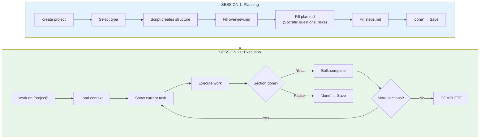
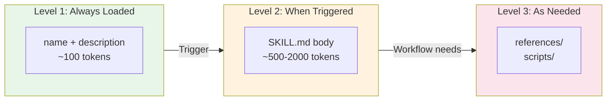

# Nexus

> **Quick Start:** Clone repo → Open in VS Code → Open Claude Chat → Say "hi" → Say "use input"
>
> ```bash
> git clone https://github.com/DorianSchlede/nexus-template.git
> ```

---

## The Problem You Have Right Now

Every time you start a new Claude session:
- You re-explain who you are and what you do
- You re-describe your project and where you left off
- You rebuild the same workflows from scratch
- You lose context, insights, and momentum

**What if Claude remembered everything?**

---

## See It Work (2 minutes)

**Today (Session 1):**
```
You: "hi"

AI: "Welcome to Nexus! Let's set up your workspace.
     What kind of work do you do?"

You: "I'm a product manager at a SaaS company"

AI: "Got it. What's your main goal for the next 3 months?"

You: "Launch our v2.0 with the new analytics dashboard"

AI: ✅ Created your Memory files
    ✅ Captured your role and goals
    ✅ Ready for your first project

You: "done"

AI: ✅ Session saved
```

**Tomorrow (Session 2):**
```
You: "hi"

AI: "Welcome back! You're the PM at [Company] working on
     the v2.0 analytics dashboard launch.

     Your active projects:
     • 05-analytics-dashboard (IN_PROGRESS - 12/28 tasks)

     What would you like to work on?"

You: "continue the dashboard project"

AI: [Loads all context, shows exactly where you left off]
    "You're on Phase 2: Design. Next task: Review wireframes.
     Ready to continue?"
```

**That's the magic.** No re-explaining. Ever.

---

## What Makes This Possible

Nexus gives you three things:

### 1. Memory That Persists
Your role, goals, and learnings are saved in files. Every session, Claude loads them automatically. You never start from zero.

### 2. Projects With Structure
Instead of freeform chatting, work happens in **Projects** — with planning documents, task lists, and progress tracking. Say "done" and everything saves.

### 3. Skills You Can Reuse
Capture workflows you repeat. Say "create skill" after doing something useful, and it becomes a one-command action forever.

---

## Quick Start

### Prerequisites

- [ ] **Claude Code Account** — [Sign up here](https://claude.ai)
- [ ] **Visual Studio Code** — [Download](https://code.visualstudio.com/)
- [ ] **Claude Code VS Code Extension** — Install from VS Code marketplace
- [ ] **Python 3.x** — [Download](https://python.org)
- [ ] **Node.js/TypeScript** — [Download](https://nodejs.org)

### Step 1: Clone & Open

1. **Clone** the repository:
   ```bash
   git clone https://github.com/DorianSchlede/nexus-template.git
   ```
2. **Open** the folder as a workspace in VS Code

### Step 2: Start Claude

1. **Open Claude Chat** via the Claude Code extension (click the Claude icon in sidebar)
2. **Log in** to your Claude Code account if prompted
3. **Say:** `hi`

The system activates automatically and starts onboarding.

### Step 3: Use the Input Folder

On your first message, say:
```
use input
```

The `00-input/` folder contains example automation ideas you can build. The AI will read these and offer to help you create them as projects or skills.

### Step 4: Complete Onboarding (~35 min)

Four guided projects teach you by doing:

| Project | What You'll Do | Time |
|---------|----------------|------|
| 00: Define Goals | Set up YOUR memory with YOUR context | 8-10 min |
| 01: First Project | Create and execute a real project | 10-12 min |
| 02: First Skill | Capture a workflow you actually repeat | 15 min |
| 03: System Mastery | Learn advanced patterns | 10 min |

### Step 5: Work Normally

After onboarding, every session is simple:

| You Say | What Happens |
|---------|--------------|
| `"hi"` | System loads your context, shows your projects |
| `"work on [project]"` | Continues exactly where you left off |
| `"[skill trigger]"` | Executes your saved workflow |
| `"done"` | Saves everything, creates session report |

---

## The Three Core Concepts

### Memory — Your Persistent Context

The `01-memory/` folder stores who you are:

```
01-memory/
├── goals.md           ← YOUR role, objectives, success metrics
├── roadmap.md         ← YOUR milestones and plans
├── core-learnings.md  ← Patterns that grow over time
└── session-reports/   ← Auto-generated session history
```

Every session, Claude loads these files first. It knows your context before you say anything.

### Projects — Structured Work

Projects have a beginning, middle, and end. Each follows the same pattern:

```
02-projects/05-dashboard-launch/
├── 01-planning/       ← What, why, how, task list
├── 02-resources/      ← Reference materials
├── 03-working/        ← Work in progress
└── 04-outputs/        ← Final deliverables
```

**The key insight:** Planning and execution happen in **separate sessions**.

1. **Planning Session** — Think deeply, define success, break into tasks
2. **Execution Sessions** — Clean context, focused work, tracked progress

This prevents the common AI trap of rushing to implementation.

### Skills — Reusable Workflows

Skills capture actions you repeat. Once saved, they execute consistently:

```
You: "generate status report"

AI: [Loads skill → Follows exact steps → Produces report]
```

Create your own with `"create skill"` after doing something useful.

---

## How Sessions Work

```
┌─────────────────────────────────────────────────────────────┐
│  START: "hi"                                                 │
│  → System loads your Memory                                  │
│  → Shows your active Projects and Skills                     │
└─────────────────────────────────────────────────────────────┘
                              ↓
┌─────────────────────────────────────────────────────────────┐
│  WORK: "work on [project]" or "[skill trigger]"             │
│  → Loads relevant context                                    │
│  → Executes systematically                                   │
│  → Tracks progress                                           │
└─────────────────────────────────────────────────────────────┘
                              ↓
┌─────────────────────────────────────────────────────────────┐
│  END: "done"                                                 │
│  → Saves all progress                                        │
│  → Updates Memory with learnings                             │
│  → Creates session report                                    │
│  → Ready to resume next time                                 │
└─────────────────────────────────────────────────────────────┘
```

---

## Requirements

**Required:**
- Claude Code Account ([sign up](https://claude.ai))
- Visual Studio Code ([download](https://code.visualstudio.com/))
- Claude Code VS Code Extension (install from marketplace)
- Python 3.x ([download](https://python.org))
- Node.js / TypeScript ([download](https://nodejs.org))

**Optional:**
- MCP servers for integrations (Airtable, Linear, Notion)
- Git for version control

---

## Learn More

- **[Product Overview](00-system/documentation/product-overview.md)** — The problems Nexus solves
- **[Framework Overview](00-system/documentation/framework-overview.md)** — Technical deep dive

---

# Technical Reference

*The sections below are for users who want deeper understanding after experiencing the system.*

---

## Folder Structure

```
Nexus/
│
├── CLAUDE.md                    # Entry point - loads on startup
│
├── 00-system/                   # FRAMEWORK (don't modify)
│   ├── core/                    # Engine scripts
│   │   ├── orchestrator.md      # AI decision logic
│   │   └── nexus-loader.py      # Context loader + router
│   ├── skills/                  # Built-in system skills
│   └── documentation/           # Framework guides
│
├── 01-memory/                   # YOUR PERSISTENT CONTEXT
│   ├── goals.md                 # Role, objectives, success criteria
│   ├── roadmap.md               # Milestones, strategic plans
│   ├── core-learnings.md        # Patterns (grows over time)
│   └── session-reports/         # Auto-generated summaries
│
├── 02-projects/                 # YOUR TEMPORAL WORK
│   └── {id}-{name}/             # Each project:
│       ├── 01-planning/         #   overview.md, plan.md, steps.md
│       ├── 02-resources/        #   Reference materials
│       ├── 03-working/          #   Work-in-progress
│       └── 04-outputs/          #   Final deliverables
│
├── 03-skills/                   # YOUR REUSABLE WORKFLOWS
│   └── {skill-name}/            # Each skill:
│       ├── SKILL.md             #   Trigger + workflow
│       ├── references/          #   Supporting docs
│       └── scripts/             #   Automation
│
└── 04-workspace/                # YOUR CUSTOM FOLDERS
    └── [Your organization]      # Client docs, specs, etc.
```

---

## Project Lifecycle



| Status | Meaning |
|--------|---------|
| `PLANNING` | Being designed |
| `IN_PROGRESS` | Active work |
| `COMPLETE` | All tasks done |
| `ARCHIVED` | Moved to archive |

---

## Progressive Disclosure: How Skills Stay Efficient

Skills use a three-level loading system:



**Why this matters:**
- Startup loads only skill metadata for all skills
- Full SKILL.md loads only when triggered
- References load only when needed

You can have 50+ skills without slowing the system.

---

## Skill Structure

```
03-skills/weekly-status-report/
├── SKILL.md                    # Required: trigger + workflow
├── references/                 # Loaded when workflow needs them
│   ├── report-template.md
│   └── metrics-guide.md
├── scripts/                    # Executed without reading
│   └── fetch_metrics.py
└── assets/                     # Used in output, never loaded
    └── logo.png
```

### SKILL.md Format

```yaml
---
name: weekly-status-report
description: Load when user says "status report", "weekly update".
             Generate summary with completed tasks and blockers.
---

## Workflow

1. Load goals.md for current objectives
2. Scan session-reports/ from last 7 days
3. Extract completed tasks from active projects
4. Identify blockers and risks
5. Generate summary with metrics
6. Save to workspace/reports/

## Advanced (load only if needed)

For custom metrics: See [metrics-guide.md](references/metrics-guide.md)
```

---

## Built-in System Skills

| Skill | Trigger | What It Does |
|-------|---------|--------------|
| `create-project` | "create project" | Guided project setup with planning |
| `create-skill` | "create skill" | Capture workflow for reuse |
| `execute-project` | "work on [name]" | Systematic project execution |
| `close-session` | "done" | Save progress, create report |
| `bulk-complete` | "mark all done" | Batch task completion |
| `archive-project` | "archive [name]" | Move completed to archive |

---

## Key Commands Reference

| Command | What Happens |
|---------|--------------|
| `"hi"` | Load system, show context |
| `"create project"` | Start guided project creation |
| `"create skill"` | Capture reusable workflow |
| `"work on [name]"` | Continue project |
| `"done"` | Save everything, end session |
| `"validate system"` | Check integrity, auto-fix |
| `"skip onboarding"` | Mark onboarding complete (advanced users) |

---

**Nexus** — Work with AI optimally. Build once, reuse forever. Never start from scratch.
